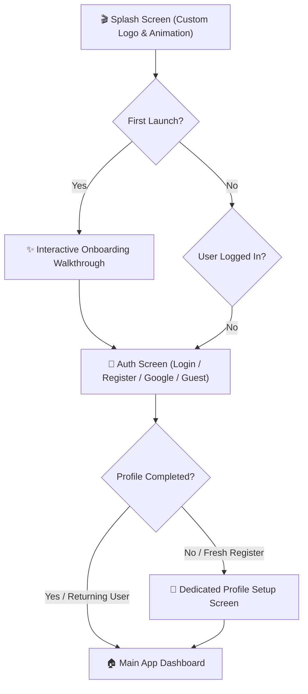

# Quovex — App Entry Flow & User Experience Redesign Spec

**Document Purpose:** Living specification capturing user feedback, design requirements, and action items for the initial user journey (Splash → Onboarding → Auth → Profile Setup).

---

## 📋 1. Logged User Feedback & Focus Areas

| Area | Current Status / Reported Issue | Action Required |
|---|---|---|
| **1. Logo & Splash Screen Animation** | Basic launcher icon / default Android splash screen. | Awaiting custom logo assets and splash screen animation specifications from the user. Prepare native Android 12+ SplashScreen API + Jetpack Compose branded animated intro. |
| **2. Onboarding Flow** | Existing onboarding flow is reported broken / not working properly. | Audit root cause (navigation callback, state persistence, step progression, or UI freeze) and rebuild with a smooth, interactive multi-step onboarding experience. |
| **3. Authentication Screen** | Existing auth page UI is sub-optimal / "not good". | Redesign the Auth Screen with premium aesthetics (dark glassmorphism, refined inputs, clear tabs for Login/Register/Guest, Apple/Google one-tap buttons, and clear validation feedback). |
| **4. Profile Setup Flow** | Missing dedicated post-auth profile setup screen. | Design and build a dedicated `ProfileSetupScreen` right after registration (Capture Display Name, Grade/Class, Target Exam like JEE/NEET/CBSE/UPSC, Study Avatar, and Daily Focus Goal). |

---

## 🗺️ 2. Proposed Target Entry Flow Architecture

---

## 🛠️ 3. Detailed Breakdown & Implementation Plan

### A. Logo & Animated Splash Screen
- **Status:** *Pending user assets & motion guidelines.*
- **Scope:**
  - Import high-resolution SVG/Vector drawable logo.
  - Implement dynamic intro animation (e.g., logo pulse, particle reveal, or smooth transition into the app).
  - Support Android 12+ system splash window without visual glitching.

### B. Onboarding Page Overhaul
- **Reported Issue:** Not working properly.
- **Scope:**
  - Fix broken navigation logic or state freezing when clicking "Get Started" / "Next".
  - Build modern swipeable carousel with animated illustrations or feature highlights (AI Tutor, Focus Mode, Spaced Repetition, Community Battles).
  - Save `has_completed_onboarding` flag to DataStore so returning users skip directly to Auth or Dashboard.

### C. Premium Auth Screen Redesign
- **Reported Issue:** Current UI lacks polish.
- **Scope:**
  - Modern dark-themed layout matching Quovex design system (Emerald `#00C896` accents on `#0A0F0D` Dark Charcoal).
  - Seamless tabs: **Sign In** and **Create Account**.
  - Google Sign-In button with proper branding.
  - "Explore as Guest" option.
  - Real-time password visibility toggles, clear input error messaging, and password strength indicators.

### D. Dedicated Profile Setup Screen
- **Reported Issue:** Not built as a discrete onboarding milestone.
- **Scope:**
  - Create `ProfileSetupScreen.kt` + `ProfileSetupViewModel.kt`.
  - Step 1: Student Name & Avatar selection.
  - Step 2: Education Level & Target Exam (e.g. Class 10/11/12/Dropper, JEE, NEET, CBSE, UPSC).
  - Step 3: Daily Study Focus Commitment (e.g., 2 hrs, 4 hrs, 6 hrs/day).
  - Persist profile directly to Cloud Firestore `users/{uid}` and Room local DB.
  - Wire into navigation graph between Auth and Dashboard.

---

## 📌 Notes & Next Steps
- Waiting for user's logo file and splash animation details.
- Once provided or instructed to proceed, will begin step-by-step implementation and live verification.
