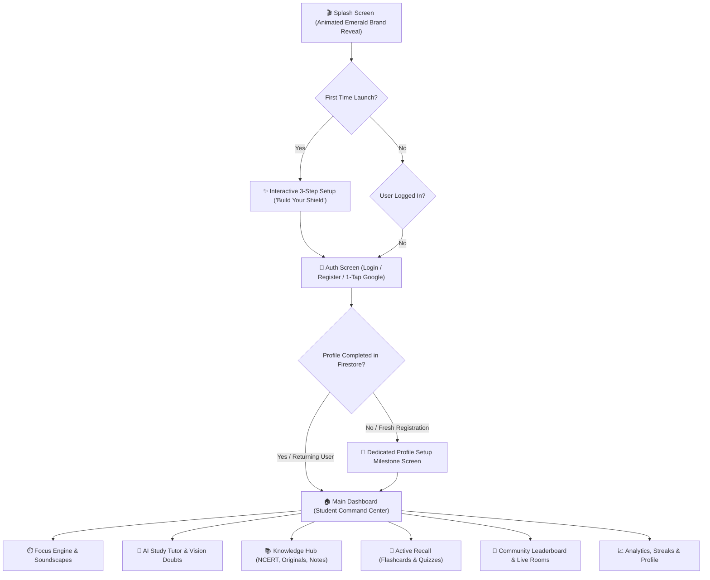

# Quovex — Comprehensive App Specification & Modern UI/UX Blueprint

**Document Version:** 2.0 (Modern Student Experience & Page-by-Page Detailing)  
**Target Audience:** High school, College & Competitive Exam Aspirants (JEE, NEET, CBSE Boards, UPSC, SAT)  
**Design System Core:** Dark Charcoal (`#0A0F0D`), Emerald Green (`#00C896`), Surface Elevated (`#15201C`), Card Dark (`#111917`), Border (`#1F2E28`), Accent Glow (`#00FF9D`), Pure Dark Theme by default.  
**Authentication Standard:** 100% Real Firebase Authentication (Email/Password & 1-Tap Google Sign-In) — **Zero Guest Mode**.

---

## 🗺️ 1. Complete App Architecture & User Journey Flow

---

## 📱 2. Page-by-Page Comprehensive Detailing

---

### Part I: Entry, Onboarding & Identity Suite

#### 1. 🎬 Splash Screen (Brand Reveal)
* **Route:** System Window → Initial Destination Router
* **Visual Styling:** Pure Dark Charcoal (`#0A0F0D`) with a centered, glowing vector Quovex Emerald logo featuring a subtle breathing glow pulse animation.
* **Technical Integration:** Seamless transition from native Android 12+ `SplashScreen` API directly into the Jetpack Compose entry router with zero jank or black frame flickers.

#### 2. ✨ Interactive Onboarding ("Build Your Study Setup")
* **Route:** `onboarding`
* **File:** [`com.quovex.ui.onboarding.OnboardingScreen`](file:///d:/Quovex%20APP/android/app/src/main/java/com/quovex/ui/onboarding/OnboardingScreen.kt)
* **Concept:** Replaces static slide carousels with an interactive 3-step personalized quiz flow:
  * **Step 1: "What's your primary battleground?"** → Selectable interactive cards:
    * `⚡ JEE / NEET (Engineering / Medical Entrance)`
    * `🎯 Class 10/12 CBSE Boards (95%+ Target)`
    * `🏆 UPSC / Civil Services / Foundation`
    * `🧠 College / Skill & Self-Mastery`
  * **Step 2: "What is your biggest study obstacle?"** →
    * `📱 Social Media & Reels Doomscrolling`
    * `😴 Procrastination & Inconsistent Streaks`
    * `🤯 Hard Concepts & Lack of Instant Doubts Help`
    * `📑 Disorganized Notes & Forgetting Formulas`
  * **Step 3: "Set your daily focus commitment:"** →
    * `⚡ 1 Hour/day (Consistent Baseline)`
    * `🔥 2.5 Hours/day (Serious Grind)`
    * `👑 4+ Hours/day (Beast Mode)`
* **Immediate Payoff:** An animated scanner graphic: *"Assembling your personalized AI tutor & anti-distraction shield..."* → Automatically navigates to Authentication with saved preferences.

#### 3. 🔐 Authentication Screen (Login & Register)
* **Route:** `auth`
* **File:** [`com.quovex.ui.auth.AuthScreen`](file:///d:/Quovex%20APP/android/app/src/main/java/com/quovex/ui/auth/AuthScreen.kt)
* **Rule:** **No Guest Mode** — every user is an authenticated student with synchronized cloud progress.
* **Layout & Features:**
  * Clean sliding tab selector: **Sign In** | **Create Account**.
  * **1-Tap Google Sign-In button** styled in dark frosted glass with native brand icon.
  * Floating dark glass input fields (`Email Address`, `Password`, `Confirm Password`) with real-time validation badges (Emerald check when valid, shake animation on error).
  * Password reveal toggle with animated eye icon.
  * Interactive "Forgot Password?" email reset modal.

#### 4. 👤 Dedicated Profile Setup Screen (Post-Registration Milestone)
* **Route:** `profile_setup`
* **File:** `com.quovex.ui.profile.ProfileSetupScreen` (To be created)
* **Purpose:** Immediately after a new student registers, they personalize their study persona before entering the app:
  * **Avatar Picker:** Grid of expressive vector study avatars (Cyber Owl, Focus Fox, Neon Brain, Wolf, Astronaut).
  * **Student Name & @Handle:** e.g., `@arjun_jee26`.
  * **Grade / Class Selector:** Class 9, 10, 11, 12, Dropper, College.
  * **Daily Focus Goal Confirmation:** Interactive slider with dynamic motivation quote.
  * **Pledge Action:** *"Lock In & Enter Quovex"* button with an energetic emerald ripple animation that saves the profile to Firestore `users/{uid}` and navigates to Dashboard.

---

### Part II: Core Dashboard & Focus Engine

#### 5. 📊 Main Dashboard (The Student Command Center)
* **Route:** `dashboard`
* **File:** [`com.quovex.ui.dashboard.DashboardScreen`](file:///d:/Quovex%20APP/android/app/src/main/java/com/quovex/ui/dashboard/DashboardScreen.kt)
* **Features:**
  * **Header:** Student avatar with active **Streak Flame Badge** (`🔥 7 Days`) + Streak Freeze Shield indicator.
  * **Daily Action Card:** *"Daily Diagnostic Ready"* — 1-tap card to take today's 5-question weakness diagnostic.
  * **Focus Launch Ring:** Large circular progress ring showing today's completed study minutes vs. daily goal (e.g., `120 / 180 mins`), with a glowing **"Start Focus Session"** button.
  * **Quick Tools Bento Grid:**
    * 📷 **Photo Doubt** (Camera icon)
    * 🤖 **AI Study Chat** (Tutor icon)
    * 📖 **NCERT / Books** (Library icon)
    * 👥 **Live Study Rooms** (Pulse live indicator)
  * **Smart Recommendations:** Automatically surfaces the student's lowest-scoring topic with a "Review Chapter" shortcut.

#### 6. ⏱️ Focus Engine & Deep Work Timer
* **Route:** `timer`
* **File:** [`com.quovex.ui.timer.TimerScreen`](file:///d:/Quovex%20APP/android/app/src/main/java/com/quovex/ui/timer/TimerScreen.kt)
* **Features:**
  * **Tactile Circular Picker:** Smooth rotary drag control with glowing Emerald progress arc.
  * **Focus Modes:** **Pomodoro (25m/5m)**, **Long Grind (50m/10m)**, or **Custom Timer**.
  * **Integrated Soundscape Mixer:** One-tap audio player with loopable ambient tracks:
    * 🎧 *Binaural Beats (Gamma 40Hz for cognitive focus)*
    * ☕ *Lo-Fi Study Cafe*
    * 🌧️ *Midnight Rain & Distant Thunder*
  * **AI Focus Camera Mode (ML Kit):** Front-camera toggle that checks for student presence and looking away; pauses timer and gently alerts if phone is abandoned.
  * **Strict Blocker Active Banner:** Shows that blacklisted apps are locked for the duration of the session via Foreground Service.

#### 7. 🛡️ Distraction Blocker Settings & Shield
* **Route:** `distraction_blocker`
* **File:** [`com.quovex.ui.blocker.DistractionBlockerScreen`](file:///d:/Quovex%20APP/android/app/src/main/java/com/quovex/ui/blocker/DistractionBlockerScreen.kt)
* **Features:**
  * **Master Switch:** "Distraction Shield" master toggle.
  * **Health Check Banner:** Displays whether `QuovexAccessibilityService` is active; provides a 1-tap launcher to Android Accessibility Settings if inactive.
  * **Category Quick Blockers:** One-tap batch toggles for Social Media (Instagram, Snapchat, TikTok), Video (YouTube, Netflix), Gaming, and Browsers.
  * **Searchable App List:** Shows all installed applications with individual lock switches and a live counter of *"Attempts Resisted Today"*.

---

### Part III: AI Learning Suite & Problem Solvers

#### 8. 💬 AI Study Companion (Tutor Chat)
* **Route:** `ai_chat`
* **File:** [`com.quovex.ui.ai.AiChatScreen`](file:///d:/Quovex%20APP/android/app/src/main/java/com/quovex/ui/ai/AiChatScreen.kt)
* **Features:**
  * **Grounded Context Header:** Shows which note or NCERT chapter is currently referenced (e.g., `📍 Grounded in: Class 12 Physics - Optics`).
  * **Streaming Chat Engine:** Typewriter-style streaming text with full LaTeX equation formatting and step-by-step math breakdowns.
  * **Quick Prompt Action Chips:**
    * *"Explain like I'm 10"*
    * *"Give me 3 practice MCQs on this"*
    * *"Derive the formula step-by-step"*
    * *"Summarize key exam traps"*
  * **Daily Quota Counter:** Pill badge showing remaining daily queries (with option to watch a rewarded video for +3 queries).

#### 9. 📸 Photo Doubt Solver (Vision AI)
* **Route:** `image_doubt`
* **File:** [`com.quovex.ui.scanner.ImageDoubtScreen`](file:///d:/Quovex%20APP/android/app/src/main/java/com/quovex/ui/scanner/ImageDoubtScreen.kt)
* **Features:**
  * **Camera Viewfinder:** Smart frame overlay with document corner alignment guidelines.
  * **Fast Crop Selector:** Isolates printed or handwritten equations/questions from messy background notes.
  * **Structured Solution Tabs:**
    * **Tab 1: Core Concept** (What principle/theorem is being tested).
    * **Tab 2: Step-by-Step Solution** (Numbered formulas and derivations).
    * **Tab 3: Final Answer** (Highlighted boxed result).
    * **Tab 4: Similar Practice Question** (Instant test question to verify understanding).

#### 10. 📄 Document Scanner / OCR
* **Route:** `document_scanner`
* **File:** [`com.quovex.ui.scanner.DocumentScannerScreen`](file:///d:/Quovex%20APP/android/app/src/main/java/com/quovex/ui/scanner/DocumentScannerScreen.kt)
* **Features:**
  * **Multi-Page Capture:** Snap multiple textbook pages in sequence.
  * **Auto-Enhance:** Auto-contrast black & white filter for clean textbook reading.
  * **Instant Action:** One-tap "Save as Study Material" or "Generate Flashcard Deck".

#### 11. 📅 AI Study Planner (Exam Roadmaps)
* **Route:** `study_planner`
* **File:** [`com.quovex.ui.planner.StudyPlannerScreen`](file:///d:/Quovex%20APP/android/app/src/main/java/com/quovex/ui/planner/StudyPlannerScreen.kt)
* **Features:**
  * **Target Exam Countdown:** Live days-remaining widget (e.g., `142 Days until JEE Main`).
  * **Visual Roadmap:** Interactive 30/60/90-day milestone timeline showing completed, in-progress, and upcoming chapters.
  * **Dynamic Re-Plan Button:** Missed a day? Tap *"Auto-Rebalance Plan"* to dynamically redistribute missed chapters across upcoming weeks without guilt.

---

### Part IV: Knowledge Hub & Content Libraries

#### 12. 🏛️ Knowledge Hub (Main 3-Tab Portal)
* **Route:** `knowledge_hub`
* **File:** [`com.quovex.ui.knowledge.KnowledgeHubScreen`](file:///d:/Quovex%20APP/android/app/src/main/java/com/quovex/ui/knowledge/KnowledgeHubScreen.kt)
* **Features:**
  * **Navigation:** Sleek sliding pill tab bar:
    * **Tab 1: NCERT Official**
    * **Tab 2: Quovex Originals**
    * **Tab 3: My Materials**
  * **Universal Search:** Instant search bar filtering across all 3 catalogs simultaneously.

#### 13. ➕ Add Material & URL Importer
* **Routes:** `add_material`, `import_url`
* **Files:** [`AddMaterialScreen.kt`](file:///d:/Quovex%20APP/android/app/src/main/java/com/quovex/ui/material/AddMaterialScreen.kt), [`ImportUrlScreen.kt`](file:///d:/Quovex%20APP/android/app/src/main/java/com/quovex/ui/material/ImportUrlScreen.kt)
* **Features:**
  * **Manual Note Editor:** Markdown text editor with formula support.
  * **PDF / Doc Upload:** Local file picker with auto-classification into Subject and Topic.
  * **Web Importer:** Paste any URL (Wikipedia, GeeksforGeeks, Khan Academy) → extracts clean article text, removes ads, and formats into a study note.

#### 14. 📝 Material Detail & Note Reader
* **Route:** `material_detail/{materialId}`
* **File:** [`com.quovex.ui.material.MaterialDetailScreen`](file:///d:/Quovex%20APP/android/app/src/main/java/com/quovex/ui/material/MaterialDetailScreen.kt)
* **Features:**
  * **Bento Card Summary:** AI-generated Executive Summary, Core Key Points, and Formula Box.
  * **Action Speed-Dial:**
    * 🃏 *"Generate 10 Flashcards"*
    * 📝 *"Create Practice Quiz"*
    * 💬 *"Ask AI Tutor About This Note"*

#### 15. 📖 Official NCERT Browser & Book Detail
* **Routes:** `ncert_browser`, `ncert_book_detail/{bookId}`
* **Files:** [`NcertBrowserScreen.kt`](file:///d:/Quovex%20APP/android/app/src/main/java/com/quovex/ui/ncert/NcertBrowserScreen.kt), [`NcertBookDetailScreen.kt`](file:///d:/Quovex%20APP/android/app/src/main/java/com/quovex/ui/ncert/NcertBookDetailScreen.kt)
* **Features:**
  * **Class & Subject Filter:** Class 6 to 12 buttons + Physics, Chemistry, Biology, Mathematics, Social Sciences.
  * **Book Grid:** Official textbook covers with completion percentage rings and offline download status.
  * **Chapter Directory:** Chapter lists with estimated read times and direct links to Quizzes.

#### 16. 📑 NCERT Chapter Detail & In-App PDF Reader
* **Routes:** `ncert_chapter_detail/{chapterId}`, `ncert_pdf_reader/{chapterId}`
* **Files:** [`NcertChapterDetailScreen.kt`](file:///d:/Quovex%20APP/android/app/src/main/java/com/quovex/ui/ncert/NcertChapterDetailScreen.kt), [`NcertPdfReaderScreen.kt`](file:///d:/Quovex%20APP/android/app/src/main/java/com/quovex/ui/ncert/NcertPdfReaderScreen.kt)
* **Features:**
  * **Chapter Summary Sheet:** Key definitions and formula recap before opening full PDF.
  * **PDF Viewer:** Smooth offline PDF reader with pinch-to-zoom, dark reading mode inversion, page jumper, and bookmarking.

#### 17. 🎓 Quovex Originals Browser & Book Detail
* **Routes:** `originals_browser`, `original_book_detail/{bookId}`
* **Files:** [`OriginalsBrowserScreen.kt`](file:///d:/Quovex%20APP/android/app/src/main/java/com/quovex/ui/originals/OriginalsBrowserScreen.kt), [`OriginalBookDetailScreen.kt`](file:///d:/Quovex%20APP/android/app/src/main/java/com/quovex/ui/originals/OriginalBookDetailScreen.kt)
* **Features:**
  * **Catalog:** Specialized deep-dive books generated by Content Studio with difficulty ratings (Beginner, Intermediate, Advanced) and exam relevance badges.
  * **Book Detail:** Table of contents, author & fact-check credentials, and reading progress.

#### 18. 📖 Quovex Originals Interactive Reader
* **Route:** `original_chapter_reader/{bookId}/{chapterNumber}`
* **File:** [`com.quovex.ui.originals.OriginalChapterReaderScreen`](file:///d:/Quovex%20APP/android/app/src/main/java/com/quovex/ui/originals/OriginalChapterReaderScreen.kt)
* **Features:**
  * **Reader:** High-typography reading experience with interactive expandable concept boxes, LaTeX equations, and inline practice checkpoints.

---

### Part V: Active Recall & Spaced Repetition

#### 19. 🗂️ Deck Overview & Mastery Center
* **Route:** `deck_overview/{deckId}`
* **File:** [`com.quovex.ui.decks.DeckOverviewScreen`](file:///d:/Quovex%20APP/android/app/src/main/java/com/quovex/ui/decks/DeckOverviewScreen.kt)
* **Features:**
  * **Mastery Breakdown:** Visual color-coded progress: `🟢 Mastered (80%)`, `🟡 Review Due (15%)`, `⚪ Unseen (5%)`.
  * **Spaced Repetition Stats:** Next review schedule according to the SM-2 algorithm.
  * **Action Buttons:** *"Start Review"* (Due cards only) or *"Cram All Cards"*.

#### 20. 🃏 3D Flashcard Player
* **Route:** `flashcard_player/{deckId}`
* **File:** [`com.quovex.ui.flashcards.FlashcardPlayerScreen`](file:///d:/Quovex%20APP/android/app/src/main/java/com/quovex/ui/flashcards/FlashcardPlayerScreen.kt)
* **Features:**
  * **Mechanic:** Smooth 3D card flip animation on tap.
  * **Rating Controls:** 4 tactile action buttons:
    * 🔴 **Again** (10 mins)
    * 🟠 **Hard** (1 day)
    * 🔵 **Good** (3 days)
    * 🟢 **Easy** (7 days)
  * **Completion Celebration:** Confetti particle animation, mastery gain stat, and streak increment.

#### 21. ❓ Interactive Practice Quiz
* **Route:** `quiz/{materialId}`
* **File:** [`com.quovex.ui.quiz.QuizScreen`](file:///d:/Quovex%20APP/android/app/src/main/java/com/quovex/ui/quiz/QuizScreen.kt)
* **Features:**
  * **Quiz Arena:** Clean card interface with timer countdown bar.
  * **Instant Feedback:** Selected option turns Emerald (correct) or Red (incorrect) with an immediate AI explanation box.
  * **Score Summary:** Detailed report card showing accuracy %, speed per question, and a 1-tap *"Save Weak Concepts as Flashcards"* button.

#### 22. 🎯 Daily Diagnostic Quiz (Mastery Evaluator)
* **Route:** `daily_diagnostic_quiz`
* **File:** [`com.quovex.ui.quiz.DailyDiagnosticQuizScreen`](file:///d:/Quovex%20APP/android/app/src/main/java/com/quovex/ui/quiz/DailyDiagnosticQuizScreen.kt)
* **Features:**
  * **Concept:** 5 adaptive questions daily targeting the student's registered exam subjects.
  * **Weak Spot Radar:** Updates student's subject mastery radar chart after each daily quiz.

---

### Part VI: Community & Social Study Rooms

#### 23. 🌐 Community Hub & Leaderboards
* **Route:** `community`
* **File:** [`com.quovex.ui.community.CommunityScreen`](file:///d:/Quovex%20APP/android/app/src/main/java/com/quovex/ui/community/CommunityScreen.kt)
* **Features:**
  * **Leaderboard Tabs:** **Global** | **My Friends** | **Weekly Sprint**.
  * **Podium Display:** Top 3 students with Gold, Silver, Bronze avatar frames and total focus hours.
  * **1v1 Study Battles:** Quick 5-question quiz duels against classmates or random peers.

#### 24. 🎧 Live Study Room (Sync Focus)
* **Route:** `study_room_live/{roomId}`
* **File:** [`com.quovex.ui.community.StudyRoomLiveScreen`](file:///d:/Quovex%20APP/android/app/src/main/java/com/quovex/ui/community/StudyRoomLiveScreen.kt)
* **Features:**
  * **Room Feed:** Displays live participant avatars with status dots (`🟢 Focusing (23m left)`, `🟡 Break`).
  * **Synchronized Timer:** Room-wide shared Pomodoro clock.
  * **Ambient Study Chat:** Minimal study room message feed with reaction emojis and soundscape sync.

---

### Part VII: Resilience, Identity & Monetization

#### 25. 🔥 Streak Center & "Streak Cemetery"
* **Route:** `streak`
* **File:** [`com.quovex.ui.streak.StreakScreen`](file:///d:/Quovex%20APP/android/app/src/main/java/com/quovex/ui/streak/StreakScreen.kt)
* **Features:**
  * **Streak Shield:** Interactive flame graphic showing consecutive study days.
  * **Streak Freeze Inventory:** Shows available Streak Freezes (e.g. `2 Available`).
  * **Streak Cemetery (Revive Mechanic):** If a student breaks their streak, it moves to the Cemetery with a "Revive Challenge" (Complete a 45-minute focus session or 100% quiz score to restore the broken streak).

#### 26. 📈 Performance Analytics Center
* **Route:** `analytics`
* **File:** [`com.quovex.ui.analytics.AnalyticsScreen`](file:///d:/Quovex%20APP/android/app/src/main/java/com/quovex/ui/analytics/AnalyticsScreen.kt)
* **Features:**
  * **Weekly Focus Heatmap:** GitHub-style daily study intensity blocks.
  * **Subject Time Split:** Donut chart of hours spent (e.g. Physics 40%, Chemistry 35%, Math 25%).
  * **Productivity Score:** AI-calculated focus score based on distracted app attempts vs. deep work time.

#### 27. ⚙️ Profile & Settings
* **Route:** `profile`
* **File:** [`com.quovex.ui.profile.ProfileScreen`](file:///d:/Quovex%20APP/android/app/src/main/java/com/quovex/ui/profile/ProfileScreen.kt)
* **Features:**
  * **Header:** Student avatar, @handle, target exam badge, and Pro status.
  * **Preferences:** Dark mode defaults, soundscape volume, notification schedules.
  * **Account Controls:** Edit profile details, change password, and sign out.

#### 28. 👑 Premium Subscription Paywall
* **Route:** `premium_paywall`
* **File:** [`com.quovex.ui.premium.PremiumPaywallScreen`](file:///d:/Quovex%20APP/android/app/src/main/java/com/quovex/ui/premium/PremiumPaywallScreen.kt)
* **Features:**
  * **Value Grid:** Clear feature comparison (Unlimited AI queries, zero ads, unlimited study rooms, offline PDF library downloads).
  * **Billing Toggles:** **Pro Monthly** vs. **Pro Annual (Best Value)** vs. **Lifetime Access**.
  * **1-Tap Google Play Checkout:** Instant purchase with dynamic unlock animations upon confirmation.

---

## 🎨 3. Full Dual-Theme System Specification (Dark Mode & Light Mode)

### A. Theme Architecture & Modes
The app fully supports three selectable visual modes:
1. 🌙 **Dark Mode (Default / Cyber OLED):** Deep high-contrast dark palette tailored for night-time and deep focus study sessions.
2. ☀️ **Light Mode (Clean Editorial Paper):** Clean, crisp, high-legibility light palette designed for daylight and classroom reading.
3. 📱 **System Default Mode:** Dynamically follows the Android OS system night mode schedule.

### B. Color Mapping Matrix

| Design Token | Dark Mode (OLED Focus) | Light Mode (Clean Editorial) | Usage |
|---|---|---|---|
| `primary` | `#00C896` (Emerald Bright) | `#009B74` (Emerald Deep) | Primary buttons, active tabs, progress rings, icons |
| `primaryContainer` | `#003828` | `#C3FBE6` | Chip backgrounds, subtle active state indicators |
| `background` | `#0A0F0D` (Dark Charcoal) | `#F7F9F8` (Soft Off-White) | App window base background |
| `surface` | `#111917` (Deep Card) | `#FFFFFF` (Crisp White Card) | Standard cards, lists, dialogs |
| `surfaceElevated` | `#16231F` | `#F1F5F3` | Popovers, top app bars, bottom sheets |
| `surfaceVariant` | `#1C2B24` (Input Glass) | `#EDF2EF` | Search inputs, text fields, unselected chips |
| `border` | `#2D4438` | `#D9E2DC` | Card borders, divider lines |
| `textPrimary` | `#E8F5F0` (Bright Mint White) | `#0F172A` (Slate Dark) | Main titles, headlines, primary body copy |
| `textSecondary` | `#8AAFA3` (Muted Mint) | `#475569` (Slate Muted) | Subtitles, metadata, timestamps |
| `textTertiary` | `#567269` | `#94A3B8` | Placeholders, inactive hints |
| `error` | `#FF5252` | `#D32F2F` | Form errors, wrong quiz options, danger actions |
| `warning` | `#FF9F1C` | `#D97706` | Pending items, streak freeze indicators |
| `success` | `#00C896` | `#059669` | Correct quiz answers, completed milestones |

### C. Technical Implementation & Persistence
* **State Source:** `UserPreferencesManager.themeMode: StateFlow<ThemeMode>` (persisted in SharedPreferences key `"theme_mode"`).
* **Root Application Wiring:** `MainActivity.kt` observes `themeMode` and dynamically passes `darkTheme = isDark` to root `QuovexTheme`.
* **In-App Control:** Accessible under `ProfileScreen.kt` ("Appearance & Theme" card) with real-time UI recomposition without restarting the application.
* **Component Rule:** All UI Composables strictly bind to semantic tokens via `QuovexTheme.colors.*` rather than hardcoded hex values.

---

## 📦 4. Official Brand Identity & Master Asset Inventory Mapping

### A. 🌟 Official 3-Piece Brand Identity Suite

| Brand Asset | Target Android Resource | Screen & Purpose |
|---|---|---|
| **3D Circular "Q" Stopwatch Emblem** | `res/drawable/ic_brand_emblem.png` & `mipmap/` | **Android Launcher App Icon** (`mipmap-mdpi` through `xxxhdpi`), **Splash Screen Center Hero**, and **Compact Top App Bar Brand Mark** |
| **Cosmic Emerald Math Vortex** | `res/drawable/bg_cosmic_vortex.png` | **Splash Screen Animated Cosmic Backdrop**, **Auth Screen Ambient Glow**, and **Onboarding Step 1 Hero Dimension** |
| **3D Chrome "QUOVEX" Wordmark** | `res/drawable/ic_brand_wordmark.png` | **Auth Screen Header Masthead**, **Splash Screen Title Reveal**, and **About & Settings Dialog Title** |

---

### B. Master Feature Asset Mapping (46 Assets)

| Generated Asset in `New folder/` | Standardized Resource Name | Screen / Placement |
|---|---|---|
| `avatar_1...-removebg.png` to `avatar_12...-removebg.png` | `res/drawable/avatar_1.png` to `avatar_12.png` | **Profile Setup**, **User Profile**, **Leaderboards**, & **Live Study Rooms** (Transparent backgrounds for Dark & Light modes) |
| `ill_welcome...-removebg.png` | `res/drawable/ill_welcome.png` | **Onboarding Screen (Step 1)**: "Welcome to Quovex — Build Your Study Setup" |
| `ill_focus_blocked...-removebg.png` | `res/drawable/ill_focus_blocked.png` | **Onboarding Screen (Step 2)**: "Kill Distractions" & **Distraction Blocker Screen Header** |
| `ill_permissions...-removebg.png` | `res/drawable/ill_permissions.png` | **Accessibility Service Permission Sheet** & Notification Setup Dialog |
| `ill_empty_notes...-removebg.png` | `res/drawable/ill_empty_notes.png` | **Knowledge Hub (My Materials)**: Empty state when no study notes uploaded |
| `og_banner...-removebg.png` | `res/drawable/banner_ai_focus.png` | **Premium Paywall Screen Header** & **AI Study Planner Hero Card** |
| `hero_mockup...-removebg.png` | `res/drawable/hero_mockup.png` | **Onboarding Tour / Features Summary Card** |
| `Floating_badge_with_neon_atom_...png` | `badge_exam_jee.png` | **Onboarding Step 1:** Target Exam → `JEE Main & Advanced` |
| `Stethoscope_wrapped_around_DNA_...png` | `badge_exam_neet.png` | **Onboarding Step 1:** Target Exam → `NEET UG Medical` |
| `Graduation_cap_and_scroll_...png` | `badge_exam_cbse.png` | **Onboarding Step 1:** Target Exam → `CBSE Class 10/12 Boards` |
| `Floating_badge_with_lion_emblem_...png` | `badge_exam_upsc.png` | **Onboarding Step 1:** Target Exam → `UPSC / Civil Services` |
| `Smartphone_wrapped_in_glowing_ch_...png` | `badge_obstacle_social_media.png` | **Onboarding Step 2:** Obstacle → `Social Media Doomscrolling` |
| `Cloud_raining_over_melting_clock_...png` | `badge_obstacle_procrastination.png` | **Onboarding Step 2:** Obstacle → `Procrastination & Brain Fog` |
| `Lightbulb_breaking_from_maze_puzzle_...png` | `badge_obstacle_doubts.png` | **Onboarding Step 2:** Obstacle → `Hard Concepts & Doubts` |
| `Neon_spark_orb_in_cradle_...png` | `badge_goal_1hr.png` | **Onboarding Step 3:** Goal → `1 Hour/day` |
| `Burning_emerald_flame_badge_...png` | `badge_goal_2_5hr.png` | **Onboarding Step 3:** Goal → `2.5 Hours/day` |
| `Cybernetic_crown_with_emerald_fl_...png` | `badge_goal_4hr.png` | **Onboarding Step 3:** Goal → `4+ Hours/day` |
| `Futuristic_robot_sphere_floating_...png` | `ic_ai_tutor_robot.png` | **AI Tutor Companion Avatar & Dashboard Tool** |
| `Holographic_camera_scanner_brack_...png` | `ic_doubt_scanner_viewfinder.png` | **Photo Doubt Solver Viewfinder & Crop Screen** |
| `Laser_scanning_book_text_...png` | `ic_scanner_document_laser.png` | **Document Scanner & Multi-Page OCR Screen** |
| `Floating_holographic_calendar_gr_...png` | `ic_planner_calendar_roadmap.png` | **AI Study Planner 30/60/90-Day Roadmap Screen** |
| `Floating_slate_tablet_with_formulas_...png` | `ic_notes_formula_sheet.png` | **Formula Sheet Generator & Note Summary Detail** |
| `Futuristic_circular_stopwatch_...png` | `ic_timer_stopwatch.png` | **Focus Timer Screen Header & Deep Work Dial** |
| `Cybernetic_brain_sphere_with_sou_...png` | `ic_soundscape_binaural.png` | **Soundscape 1:** `Binaural Beats (40Hz Gamma)` |
| `Cassette_tape_and_coffee_cup_...png` | `ic_soundscape_lofi.png` | **Soundscape 2:** `Lo-Fi Study Cafe` |
| `Storm_cloud_with_glowing_raindrops_...png` | `ic_soundscape_rain.png` | **Soundscape 3:** `Midnight Rain & Thunder` |
| `Floating_planet_with_glowing_rings_...png` | `ic_soundscape_space.png` | **Soundscape 4:** `Deep Space White Noise` |
| `Holographic_camera_lens_scanning_...png` | `ic_camera_focus_lens.png` | **AI Face Detection Active Indicator** |
| `Quantum_orbital_sphere_floating_...png` | `ic_subject_physics.png` | **NCERT & Originals: Physics** |
| `Benzene_ring_connected_to_flask_...png` | `ic_subject_chemistry.png` | **NCERT & Originals: Chemistry** |
| `Mobius_strip_with_math_symbols_...png` | `ic_subject_maths.png` | **NCERT & Originals: Mathematics** |
| `Emerald_plant_sprout_emerging_ca_...png` | `ic_subject_biology.png` | **NCERT & Originals: Biology** |
| `Greek_pillar,_compass,_and_scroll_...png` | `ic_subject_history.png` | **NCERT & Originals: History & Social Sciences** |
| `Binary_code_displaying_in_terminal_...png` | `ic_subject_cs.png` | **NCERT & Originals: Computer Science** |
| `Holographic_flashcards_floating_...png` | `ic_deck_flashcards.png` | **Flashcard Deck Overview & Review Center** |
| `Emerald_brain_model_with_clockwork_...png` | `ic_spaced_repetition_brain.png` | **SM-2 Memory Retention Mastery Graph** |
| `Quiz_game_show_buzzer_podium_...png` | `ic_quiz_arena.png` | **Practice Quiz Arena Screen** |
| `Radar_scanner_sweeping_skill_nodes_...png` | `ic_diagnostic_radar.png` | **Daily Diagnostic Quiz Weakness Radar** |
| `Flame_badge_with_green_fire_...png` | `ic_streak_flame_blazing.png` | **Streak Center & Header Streak Badge** |
| `Crystalline_ice_shield_with_flame_...png` | `ic_streak_freeze_shield.png` | **Streak Freeze Shield Inventory** |
| `Obsidian_rune_stone_bursting_energy_...png` | `ic_streak_cemetery_rune.png` | **Streak Cemetery Revive Challenge Screen** |
| `Glowing_plant_sprout_in_pot_...png` | `ic_rank_novice.png` | **Scholar Rank 1: Novice Aspirant** |
| `Open_metallic_book_with_quill_...png` | `ic_rank_apprentice.png` | **Scholar Rank 2: Apprentice Scholar** |
| `Silver_and_emerald_cyber_helmet_...png` | `ic_rank_strategist.png` | **Scholar Rank 3: Master Strategist** |
| `Futuristic_championship_trophy_f_...png` | `ic_rank_grandmaster.png` | **Scholar Rank 4: Grandmaster / Paywall Pro** |
| `Crossed_energy_sabers_clashing_...png` | `ic_community_battle.png` | **1v1 Quiz Battle Arena** |
| `Glass_study_table_with_lamps_...png` | `ic_community_live_room.png` | **Live Synchronized Study Room Screen** |
| `Tournament_podium_with_cyber_crowns_...png` | `ic_community_leaderboard.png` | **Global & Friends Leaderboard Podium** |
| `UFO_beaming_light_on_notebook_...png` | `ill_empty_notes_ufo.png` | **My Materials Empty State** |
| `Futuristic_titanium_storage_ches_...png` | `ill_empty_decks_chest.png` | **Flashcards Empty State** |
| `Magnifying_glass_hovering_over_f_...png` | `ill_search_not_found.png` | **Universal Search Zero-Results State** |
| `Broken_fiber-optic_cable_sparking_...png` | `ill_offline_cable.png` | **Offline / Network Disconnected Screen** |
| `Emerald_notification_bell_with_p_...png` | `ill_permissions_security.png` | **Accessibility & Permissions Dialog** |
| `deck_physics_bg.jpeg` ... `deck_history_bg.jpeg` | `res/drawable/deck_*_bg.jpg` | **Flashcard Decks & NCERT Subject Covers** |

---

### B. Remaining Assets Needed / Recommended

The visual and illustration pipeline is now $\approx 90\%$ complete. Here are the few remaining assets needed to reach 100% production readiness:

| Priority | Asset Type | Recommended Filename | Why It's Needed |
|---|---|---|---|
| 🟡 **P1 (High)** | **Ambient Soundscape Audio Loops** | `sound_binaural_40hz.ogg`, `sound_lofi_cafe.ogg`, `sound_rain_thunder.ogg` | 30-to-60-second seamless audio loops bundled into `res/raw/` for offline focus timer audio playback. |
| 🟡 **P1 (High)** | **Splash Lottie Animation (Optional)** | `splash_animation.json` | If you want a vector motion animation for the logo assemble/pulse rather than Jetpack Compose code animation. |
| 🟢 **P2 (Nice to Have)** | **Subject Vector Icons** | `ic_subject_physics.svg`, `ic_subject_chemistry.svg`, `ic_subject_maths.svg`, `ic_subject_biology.svg` | Crisp monochrome vector icons for compact subject chips across Knowledge Hub. |
| 🟢 **P2 (Nice to Have)** | **Sound Effect Ticks** | `sfx_timer_tick.ogg`, `sfx_card_flip.ogg`, `sfx_quiz_correct.ogg`, `sfx_streak_fanfare.ogg` | Subtle micro-sound effects for gamified interactions (can also be toggled on/off in settings). |

---

### C. Ingestion & Optimization Workflow
1. **Directory Ingestion:** Assets sourced directly from `d:\Quovex APP\asserts/`.
2. **Naming & Scaling:** Standardized to lowercase resource names (`ic_logo_*.png`, `avatar_*.png`, `ill_*.png`) and scaled across densities (`mdpi`, `hdpi`, `xhdpi`, `xxhdpi`, `xxxhdpi`).
3. **Resource Binding:** Placed in `android/app/src/main/res/drawable/` and `res/raw/`.
4. **Compose UI Integration:** Referenced directly via `painterResource(R.drawable.*)`.

---

## 💎 5. Core UI/UX & Micro-Interaction Polish Improvements

### 1. 🛸 Floating Glassmorphic Capsule Navigation Bar
* **Current State:** Standard flat Android M3 bottom bar.
* **Upgrade Plan:** Floating capsule dock hovering with 16dp horizontal margin and 12dp bottom elevation, featuring a frosted glass border (`#1F2E28`), pill glow indicator, and smooth spring physics on tab changes.

### 2. ⚡ Tabular Monospaced Digits for Timers & Stats (`tnum`)
* **Current State:** Variable-width font causing timer digits to jitter during active countdown.
* **Upgrade Plan:** Enforce `FontFeatureSettings = "tnum"` on the Focus Timer, countdowns, and XP counters for rock-solid visual anchoring.

### 3. 🌊 Animated Live Soundscape Waveform
* **Current State:** Static soundscape toggle buttons.
* **Upgrade Plan:** Interactive multi-bar live frequency visualizer that animates smoothly while Binaural Beats, Lo-Fi, or Rain ambient audio is actively playing.

### 4. 🩻 Skeleton Shimmer Loaders (Zero Spinners)
* **Current State:** Standard circular progress spinners on content loading.
* **Upgrade Plan:** Animated gradient shimmer placeholder cards across Knowledge Hub, Quizzes, Books, and Leaderboards matching the exact card dimensions.

### 5. 🎴 Bento-Grid Cards with Radial & Linear Gradient Depth
* **Current State:** Solid flat rectangular surfaces.
* **Upgrade Plan:** 135° subtle dark glass gradients (`#16231F` → `#111917`) with 1.dp emerald borders (`#2D4438`) across all dashboard cards for rich visual depth.

### 6. 📳 Tactile Haptic Micro-Feedback Engine
* **Current State:** Basic standard clicks.
* **Upgrade Plan:** Sensory haptics across key moments:
  * *Light tick* on rotary timer dial movement.
  * *Medium snap* on 3D flashcard flip.
  * *Double pulse* on quiz correct answer / streak preservation.

### 7. 🚀 Fluid Directional Screen Transitions
* **Current State:** Standard instantaneous crossfades.
* **Upgrade Plan:** Directional spring slide and zoom transitions in `QuovexNavGraph` (e.g. Dashboard zooms into Active Quiz, Hub slides horizontally into PDF Reader).

### 8. 🔥 Dynamic Flame & XP Micro-Animations
* **Current State:** Static streak icon.
* **Upgrade Plan:** Dynamic flame particle animations scaled by streak tier (Ember at 1–3 days, Blazing Emerald at 7+ days, Super-Saiyan Neon at 30+ days), plus floating `+50 XP` upward floaters on task completion.

### 9. 🤖 AI Chat "Live Typewriter" with Glowing Cursor & Quick Actions
* **Current State:** Plain text response block.
* **Upgrade Plan:** Streaming typewriter text with a pulsing neon cursor dot and quick action toolbar on each response (*Copy LaTeX*, *Save as Flashcard*, *Explain Simpler*).

### 10. 🎯 Modern Bottom Sheets with Drag Handles
* **Current State:** Standard centered Material alert dialogs.
* **Upgrade Plan:** Swipeable bottom sheets with frosted glass backgrounds, tactile drag handles, and smooth swipe-to-dismiss gestures.

---

## 🛠️ 6. Admin Panel Control Center Enhancement & Security Suite (`quovex-admin/`)

### A. 📱 Mobile Responsiveness & Adaptive Viewports
1. **Responsive Dual-Mode Sidebar (`components/Sidebar.tsx`):**
   - **Desktop ($\ge 1024\text{px}$):** Persistent sleek glassmorphic sidebar with expandable/collapsible grouping rails.
   - **Mobile ($< 1024\text{px}$):** Slide-out drawer with backdrop blur overlay (`bg-black/60 backdrop-blur-md`), triggered by a sticky top header with an animated hamburger button.
2. **Adaptive Tables → Mobile Card Stacks:**
   - User lists, moderation tickets, NCERT catalog, and audit logs automatically transform from wide multi-column tables into vertical gesture-friendly cards on mobile devices.
3. **Sticky Action Bars:**
   - Form controls, bulk publish buttons, and emergency broadcast triggers stick cleanly to the bottom viewport on mobile viewports for one-thumb reachability.

---

### B. 🔐 Enterprise Security Hardening & RBAC Enforcement
1. **Sliding-Window API Rate Limiter (`lib/security/rate-limiter.ts`):**
   - Centralized rate limiting on all `/api/*` routes (e.g. 60 requests/min for general API calls, 10 attempts/min for authentication).
2. **Dynamic PII Masking Engine (`lib/security/masking.ts`):**
   - Automatically redacts student emails (`s****@gmail.com`) and phone numbers for `MODERATOR` and `ANALYST` roles. Only `SUPER_ADMIN` can click "Reveal PII" with an immutable audit reason logged.
3. **CSRF & Origin Verification Middleware:**
   - Strict origin validation and custom header (`x-quovex-csrf`) checks on all state-modifying POST, PUT, and DELETE API endpoints.
4. **Immutable Audit Trail Database Rules (`firestore.rules`):**
   - Database-level security rules enforcing that `audit_logs` are strictly append-only (create allowed; update and delete completely blocked).

---

### C. ⚡ Missing Administrative Features & Advanced Controls

| Feature Area | Missing Tool | Implementation Plan |
|---|---|---|
| 🔔 **Push Notifications** | **Live Mobile Phone Preview** | Interactive iOS/Android phone mockup previewing title, body, and action URL in real time before campaign broadcast. |
| 🤖 **AI Study Plans** | **Student Study Plan Inspector** | Administrative UI to view, inspect, and regenerate AI study roadmaps generated by Groq & Cerebras for any individual student. |
| 📊 **Real-Time Analytics** | **Live Active Session Counter** | Real-time WebSocket/Firestore pulse indicator displaying active students in study rooms and active focus timers. |
| 🛡️ **Distraction Blocker** | **Remote Blocklist Overrides** | Dynamic remote config interface to append newly trending distracting package names to all student devices without an app update. |
| 💰 **Monetization & Ads** | **Granular Ad Placement Switches** | Instant 1-tap killswitch for individual ad unit formats (Banner, Interstitial, Rewarded) synced via Firestore in real-time. |

---

### D. 💎 Standardized UI Component Library (`components/ui/`)
1. **`QuovexCard.tsx`:** 135° dark glass gradient (`#111917` → `#0C120F`) with 1px emerald border glow (`#1F2E28`).
2. **`QuovexButton.tsx`:** Primary (Emerald glow), Secondary (Frosted glass), Danger (Crimson outline), and Ghost variants with built-in loading spinners.
3. **`QuovexBadge.tsx`:** Status badges with glowing dot indicators (`Online`, `Pro`, `Suspended`, `Flagged`, `Resolved`).
4. **`QuovexModal.tsx` & `QuovexDrawer.tsx`:** Accessible modal dialog with backdrop blur and touch swipe-to-dismiss handles.
5. **`QuovexStatsCard.tsx`:** KPI metric card with micro trend arrows ($\uparrow 14.2\%$) and dynamic sparkline graphs.
6. **`QuovexSearchInput.tsx`:** Debounced search field with instant clear button and keyboard shortcut badge (`⌘K`).
7. **`QuovexToast.tsx`:** Real-time feedback toast notifications for mutation confirmations and alerts.

