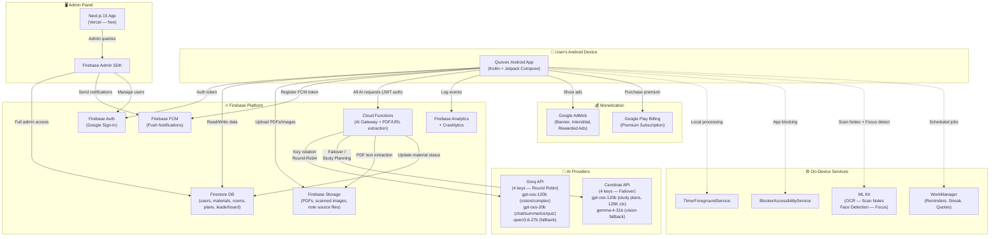
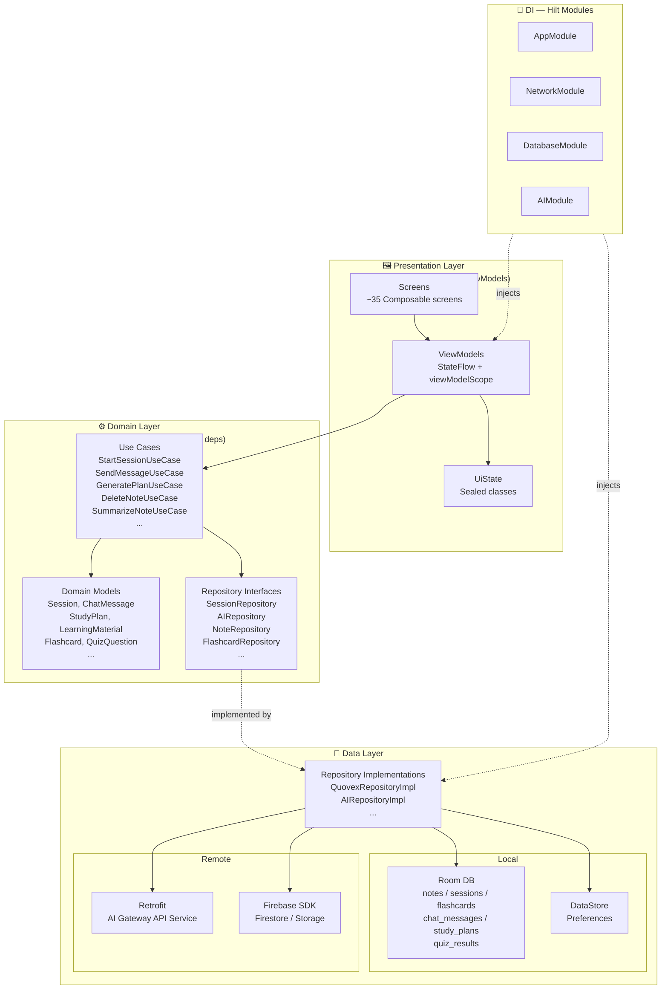
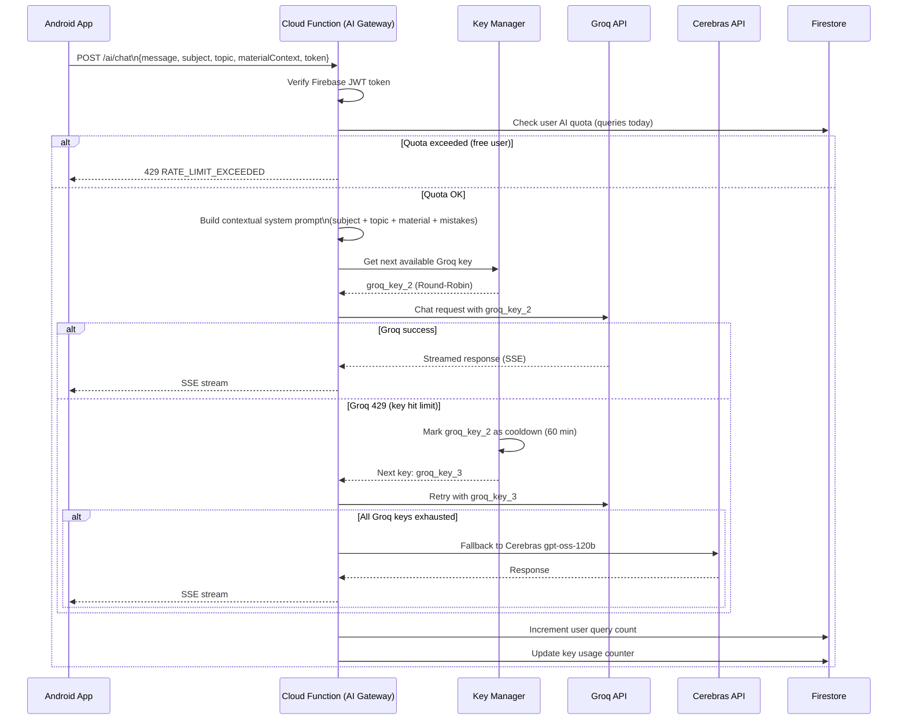
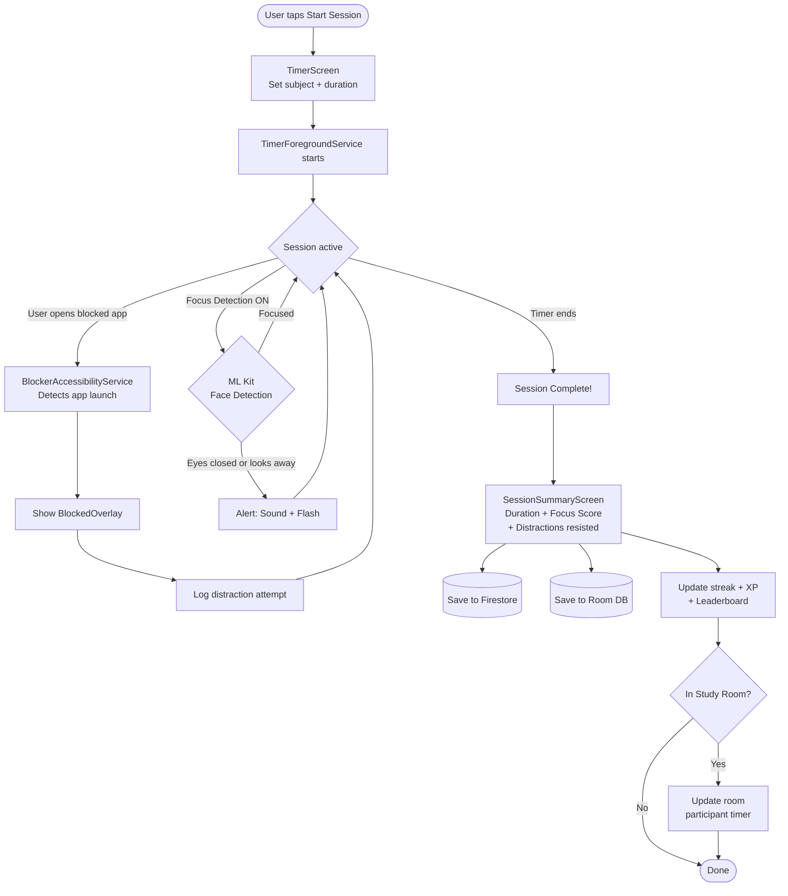
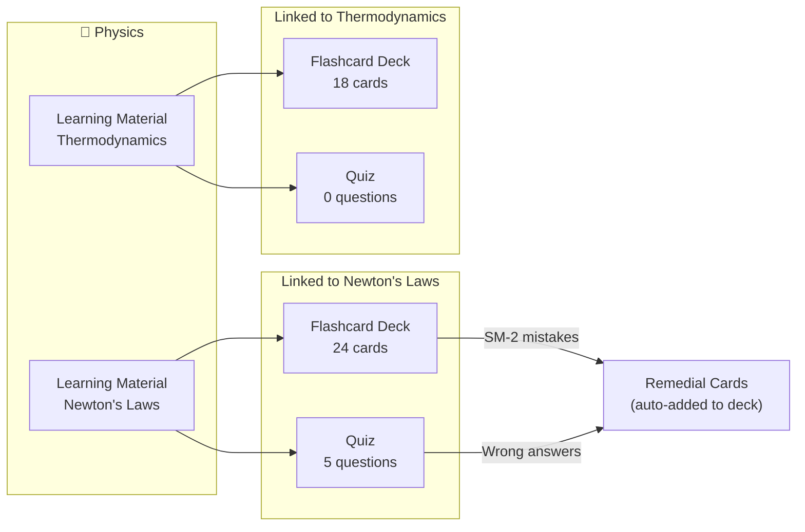
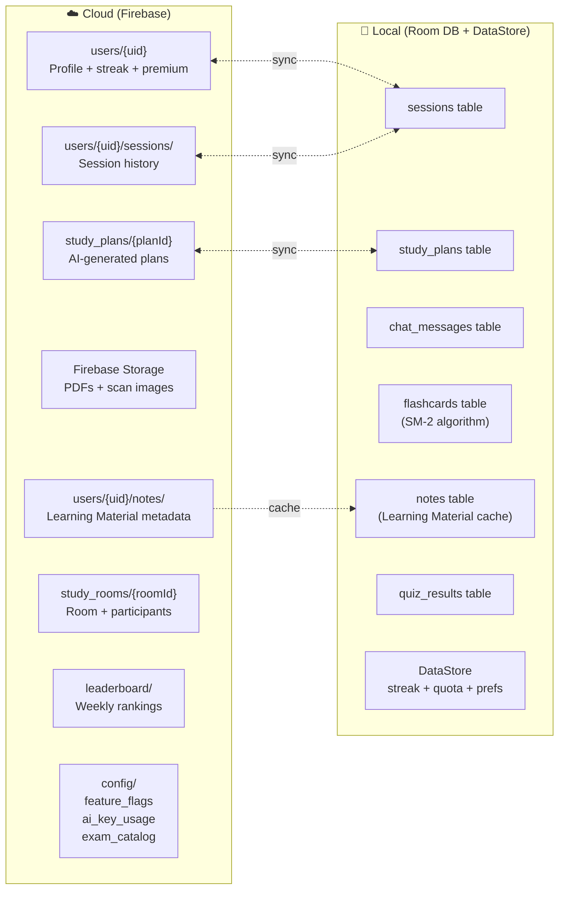
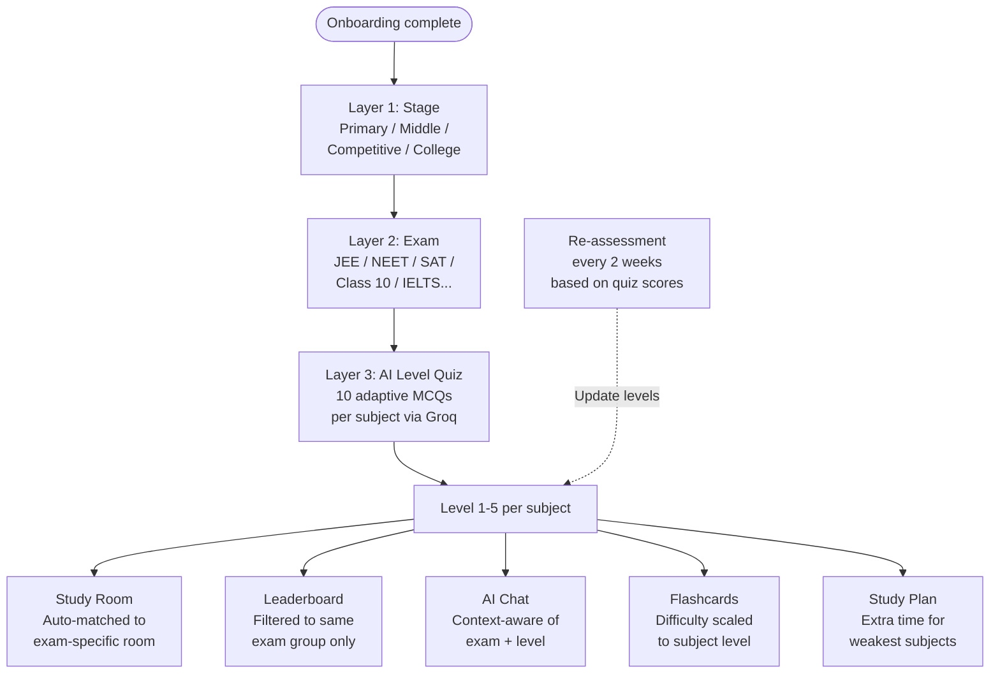
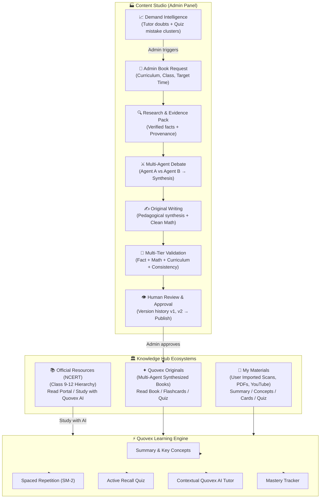

# Quovex — Architecture Map

**Version:** 2.0 | **Date:** 2026-08-22

---

## 1. Full System Architecture



---

## 2. Learning Pipeline Architecture

```mermaid
flowchart TD
    A([Student imports material]) --> B{Input Method}

    B -->|Scan Notes| S1[CameraX + ML Kit OCR\nOn-device, offline capable]
    B -->|PDF Upload| S2[Upload to Firebase Storage]
    B -->|YouTube URL| S3[Cloud Function\nFetch transcript]
    B -->|Web URL| S4[Cloud Function\nScrape + extract text]
    B -->|Quick Text| S5[Text field\nMax 10K chars]

    S1 --> TX[Extracted text blob]
    S3 --> TX
    S4 --> TX
    S5 --> TX

    S2 --> CF_PDF[Cloud Function:\npdf-parse extraction\nChunk + process]
    CF_PDF --> TX

    TX --> CLASSIFY[POST /ai/classify\nGroq gpt-oss-20b\nSubject + Topic inference]
    CLASSIFY --> CONFIRM[Subject Inference\nConfirmation Screen]
    CONFIRM --> SUMMARIZE[POST /ai/summarize\nGroq gpt-oss-20b\nSummary + Key Points + Formulas]
    SUMMARIZE --> FLASHGEN[Flashcard Generation\nGroq gpt-oss-20b JSON schema]
    FLASHGEN --> QUIZGEN[Quiz Generation\nGroq gpt-oss-20b JSON schema]
    QUIZGEN --> PERSIST[Persist everywhere]

    PERSIST --> FS_NOTE[(Firestore:\nusers/{uid}/notes/{id})]
    PERSIST --> ROOM[(Room DB:\nnotes + flashcards tables)]
    PERSIST --> FSTORE[(Firebase Storage:\noriginal file)]
    PERSIST --> SHOW([Learning Material Detail])
```

---

## 3. Android App — Clean Architecture Layers



---

## 4. AI Request Flow (Key Rotation)



---

## 5. Processing Locations Map

Where each operation actually runs:

| Operation | Where It Runs | Offline? |
|---|---|---|
| OCR (Scan Notes) | Android — ML Kit on-device | ✅ Yes |
| Face detection (Focus) | Android — ML Kit on-device | ✅ Yes |
| Image compression | Android — Bitmap processing | ✅ Yes |
| Base64 encoding | Android — java.util.Base64 | ✅ Yes |
| SM-2 spaced repetition | Android — Room + domain layer | ✅ Yes |
| Focus timer | Android — TimerForegroundService | ✅ Yes |
| App blocking | Android — AccessibilityService | ✅ Yes |
| Quiz mistake → flashcard | Android — local domain logic | ✅ Yes |
| PDF text extraction | Cloud Function — pdf-parse | ❌ No |
| URL scraping | Cloud Function — readability | ❌ No |
| YouTube transcript | Cloud Function — YouTube API | ❌ No |
| AI classification | Cloud Function → Groq | ❌ No |
| AI summarization | Cloud Function → Groq | ❌ No |
| Flashcard AI generation | Cloud Function → Groq | ❌ No |
| Quiz AI generation | Cloud Function → Groq | ❌ No |
| Image doubt solving | Cloud Function → Groq vision | ❌ No |
| AI chat response | Cloud Function → Groq | ❌ No |
| Study plan generation | Cloud Function → Cerebras | ❌ No |
| Push notifications | Firebase FCM | ❌ No |
| Premium validation | Cloud Function → Play Billing | ❌ No |

---

## 6. Study Session Flow



---

## 7. Knowledge Hub — Data Relationships



---

## 8. Data Storage Map



---

## 9. Auth + Onboarding Flow

```mermaid
flowchart TD
    A([App Launch]) --> B{Firebase Auth\nSession exists?}
    B -->|No| C[WelcomeScreen]
    B -->|Yes| D{Firestore profile\nexists?}
    D -->|Yes| HOME([HomeScreen])
    D -->|No| ON1

    C --> GAUTH[Google Sign-In]
    GAUTH --> E{New user?}
    E -->|Yes| ON1
    E -->|No| HOME

    ON1[Step 1: Personal Setup\nName + Avatar + Grade]
    ON1 --> ON2[Step 2: Exam Setup\nExam type + Date]
    ON2 --> ON3[Step 3: Subjects\n+ Self-assessed level]
    ON3 --> ON4[Step 4: Schedule\nDaily hours + Time preference]
    ON4 --> ON5[Step 5: Permissions\nNotifications + Alarms]
    ON5 --> ON6[Step 6: Notifications\nReminder time]
    ON6 --> ON7[Step 7: Ready Screen\nProfile summary]
    ON7 --> WRITE[(Write to Firestore\nusers/{uid})]
    WRITE --> HOME
```

---

## 10. Student Classification System



---

## 11. Content Ecosystem & Content Studio Architecture Map



