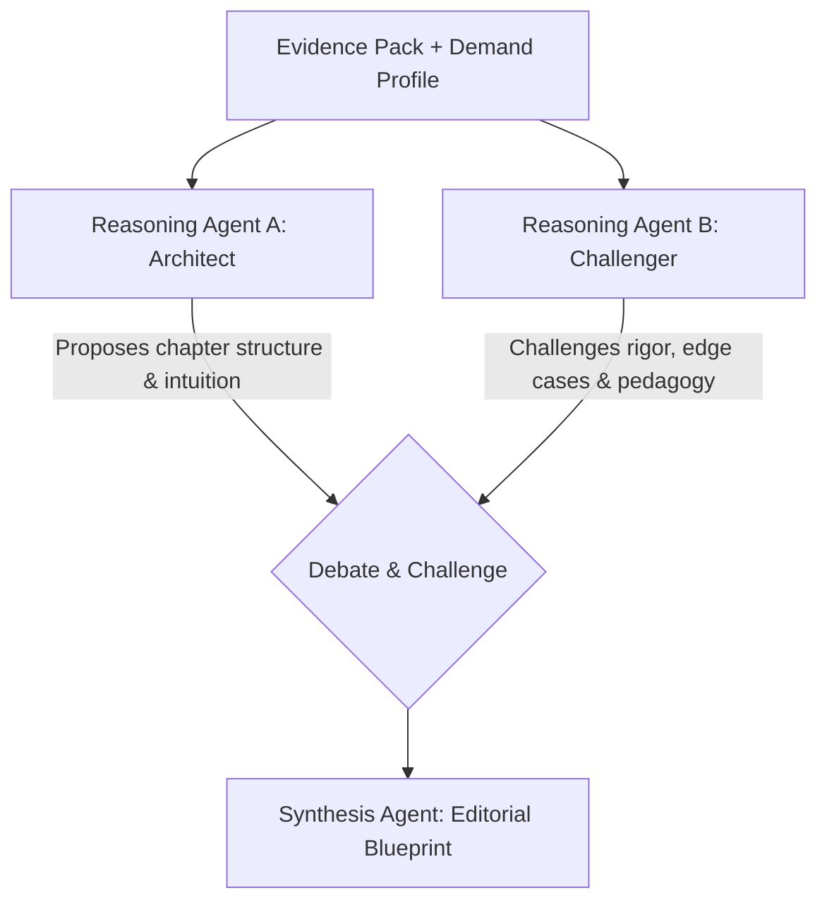

# Quovex Content Studio Specification
## Demand-Driven Educational Content Engine & Multi-Agent Authoring Pipeline

**Version:** 1.0 | **Date:** 2026-08-22  
**Status:** `PLANNED / NOT YET IMPLEMENTED`  
**Host Environment:** Quovex Admin Panel (Next.js 15 + Firebase Admin SDK)  
**Target Platform:** Quovex Android Knowledge Hub

---

## 1. Executive Summary & Core Philosophy

Quovex is built on the foundation that students do not need generic AI text dumps or mechanically rewritten summaries. They need **rigorous, high-yield, and pedagogically sound educational assets** tailored to their exact points of academic friction.

The **Quovex Content Studio** is an internal, admin-controlled authoring and editorial environment designed to produce **Quovex Originals** — original educational books and structured learning materials.

```
KNOWLEDGE HUB
│
├── 📚 NCERT / OFFICIAL RESOURCES (Curriculum Anchors — Read Portal / Study with Quovex AI)
├── ✦ QUOVEX ORIGINALS (Original Multi-Agent Reasoned Books)
└── 📁 MY MATERIALS (User-Imported Scans, PDFs, YouTube Lectures, Web Articles)
```

> [!IMPORTANT]
> **Core Governance Rules:**
> 1. **Student activity NEVER automatically generates or publishes books.** Student learning activity exclusively generates anonymized **Demand Signals**.
> 2. **Admin triggers book generation.** Only an authorized administrator can initiate a generation job.
> 3. **AI is advisory; Human approval is mandatory.** No book is ever published publicly without explicit human review and approval.
> 4. **NCERT and Official Resources are strictly classified as `OFFICIAL_RESOURCE`.** They are never claimed or labeled as Quovex Originals.
> 5. **Internal provider and model names are strictly confidential.** The public brand identity is always **`Quovex AI`**.

---

## 2. Canonical Content Type & Data Model

Content across the Quovex ecosystem adheres to three distinct models to prevent ownership confusion:

```typescript
export type ContentType = 'OFFICIAL_RESOURCE' | 'QUOVEX_ORIGINAL' | 'USER_MATERIAL';

export interface BaseContentMetadata {
    id: string;
    contentType: ContentType;
    title: string;
    subject: string;
    topic: string;
    language: string; // 'en' | 'hi' | 'es' | 'fr'
    countryRegion: string; // 'IN' | 'US' | 'UK' | 'GLOBAL'
    curriculum: string; // 'CBSE' | 'ICSE' | 'StateBoard' | 'AP' | 'IB' | 'GCSE' | 'A-Level'
    gradeClass: string; // 'Class 9' | 'Class 10' | 'Class 11' | 'Class 12' | 'Undergraduate'
    exam?: string; // 'JEE' | 'NEET' | 'SAT' | 'UPSC'
    sourceAuthority: string; // 'NCERT' | 'Quovex Studio' | 'User'
    sourceUrl?: string;
    createdAt: number;
    updatedAt: number;
}

// 1. OFFICIAL RESOURCE (e.g. NCERT Textbooks)
export interface OfficialResourceMetadata extends BaseContentMetadata {
    contentType: 'OFFICIAL_RESOURCE';
    publisher: string; // e.g. "NCERT"
    officialSourceUrl: string; // Official portal URL (e.g., ncert.nic.in)
    bookTitle: string;
    chapterNumber: number;
    rightsNotice: string;
    isStudyTransformAvailable: boolean;
}

// 2. QUOVEX ORIGINAL (Authored via Content Studio)
export interface QuovexOriginalMetadata extends BaseContentMetadata {
    contentType: 'QUOVEX_ORIGINAL';
    generationJobId: string;
    version: number; // 1, 2, 3...
    approvalStatus: 'REQUESTED' | 'GENERATING' | 'DRAFT' | 'READY_FOR_REVIEW' | 'REVISION_REQUESTED' | 'APPROVED' | 'PUBLISHED' | 'UNPUBLISHED' | 'ARCHIVED';
    approvedBy?: string; // Admin UID
    approvedAt?: number;
    createdBy: string; // Admin UID
    difficulty: 'Simple' | 'Intermediate' | 'Advanced';
    targetReadingTimeMinutes: number;
    chapterCount: number;
}

// 3. USER MATERIAL (Private student assets)
export interface UserMaterialMetadata extends BaseContentMetadata {
    contentType: 'USER_MATERIAL';
    ownerUid: string;
    inputType: 'SCAN' | 'PDF' | 'YOUTUBE' | 'WEB' | 'QUICK_TEXT';
    storageRef?: string;
    syncStatus: 'LOCAL_ONLY' | 'SYNCED' | 'PENDING_SYNC';
}
```

---

## 3. NCERT / Official Resource Library Architecture

The **NCERT Library** provides direct, structured access to official standard curriculum assets:

1. **Browse Hierarchy:**
   `Class (9–12) → Subject (Physics, Chemistry, Maths, Biology) → Book Title → Chapter Name`
2. **Dual Student Actions:**
   - **`[ Read Official NCERT ]`**: Resolves `officialSourceUrl` and opens the official NCERT publication portal in a Chrome Custom Tab. Quovex does NOT mirror, cache, or redistribute NCERT PDF files without verified licensing.
   - **`[ Study with Quovex AI ]`**: Ingests chapter concepts to generate original active learning assets (Summary, Key Concepts, Spaced Repetition Flashcards, Practice Quiz, and AI Tutor context).

---

## 4. Demand Intelligence System

Student interactions across Quovex produce aggregated, anonymized **Demand Signals** reflecting real academic difficulties:

```
Aggregated Metrics:
├── AI Tutor Doubt Frequency by Topic (e.g. 1,284 questions on "Integration by Parts")
├── Quiz Mistake Clusters (e.g. 4,921 mistakes on trigonometric substitution)
├── Low Topic Accuracy Rates (e.g. 63% average accuracy on rotational mechanics)
├── Spaced Repetition Flashcard Failure Rates (e.g. 37% lapse rate on Organic Mechanisms)
└── Image Doubt Topic Clustering (e.g. 850 photos of Ray Optics numericals)
```

**Privacy & Anonymization Rule:** Demand signals aggregate statistics across subjects, topics, curricula, and regions. Individual student identities and private chat logs are never exposed in the Content Studio.

---

## 5. Admin Book Request & Creation Workflow

When an administrator identifies a high-demand topic in the Content Studio, they configure a **Book Request**:

```
Admin Form Inputs:
├── Title: "Mastering Integration by Parts & Trigonometric Substitutions"
├── Subject: Mathematics
├── Topic: Integral Calculus
├── Curriculum: CBSE / JEE Main & Advanced
├── Class / Grade: Class 12
├── Target Audience Difficulty: Intermediate → Advanced
├── Chapter Count: 6 Chapters
├── Target Reading Time: 45 Minutes
├── Learning Objectives: [ "Derive integration by parts", "Master LIATE rule", "Avoid circular loops" ]
└── Language: English (Default)
```

Clicking **`[ Generate Draft ]`** initiates the backend generation job.

---

## 6. Research Pipeline & Evidence Pack Assembly

Before writing begins, the backend research pipeline gathers factual evidence:

1. **Permitted Sources:** Official educational repositories, approved open APIs, government educational portals, and reputable academic references.
2. **Legal & Copyright Compliance:** Strict compliance with access controls, `robots.txt`, and terms of service. No scraping of private, paywalled, or restricted content.
3. **Evidence Pack Structure:**
   - Verified facts and mathematical laws
   - Standard definitions and derivations
   - Real-world applications (e.g., aerospace engineering, biomedical devices, financial modeling)
   - Common student misconceptions and traps
   - Source provenance metadata (`sourceUrl`, `publisher`, `retrievedAt`, `evidenceId`)

---

## 7. Multi-Agent Reasoning & Debate Architecture

To guarantee deep pedagogical quality and eliminate factual errors, generation employs a multi-agent debate stage:



- **Reasoning Agent A (Architect):** Proposes chapter structure, analogies, step-by-step intuition, and worked example progressions.
- **Reasoning Agent B (Challenger):** Scrutinizes mathematical rigor, identifies potential ambiguities, challenges simplistic analogies, and tests for curriculum alignment.
- **Synthesis Agent:** Reconciles the debate and produces the final editorial blueprint.
- **Confidentiality:** The entire debate occurs internally server-side. Students never see raw debate logs or model assignments.

---

## 8. Original Educational Writing Standards

The writing agent transforms the synthesis into fresh educational literature:

- **Understand → Rethink → Reorganize → Explain → Teach.**
- **Zero Verbatim Copying:** No reproduction of external copyrighted textbook passages or source-specific phrasing.
- **Real-World Examples:** Newly written contextual applications (e.g., how Lenz's law enables magnetic levitation trains; how Euler's formula powers signal processing).
- **Mathematical Readability:** Strict formatting for clean rendering:
  - Superscripts/Subscripts: $x²$, $x³$, $aₙ$, $10⁻³$
  - Clean Roots: $\sqrt{x}$, $\sqrt{x² + y²}$
  - Trigonometric Powers: $\sin²\theta$, $\cos²\theta$
  - Greek Symbols: $\theta$, $\alpha$, $\beta$, $\lambda$, $\pi$
  - Comparison & Logic: $\le$, $\ge$, $\ne$, $\to$
  - Chemical Formulas: $\text{H}_2\text{SO}_4$, $\text{H}_2\text{O}$, $\text{CO}_2$

---

## 9. Multi-Tier Content Validation

Before reaching human editors, every draft book undergoes automated verification:

| Validation Tier | Scope of Check |
|---|---|
| **1. Fact Validation** | Verifies scientific facts and historical claims against the Evidence Pack |
| **2. Math & Formula Validation** | Validates algebraic steps, numerical calculations, and unit consistency ($F = ma$, $\text{m/s}²$) |
| **3. Terminology Validation** | Ensures standardized academic terms matching the target curriculum (e.g. CBSE/JEE terminology) |
| **4. Curriculum Validation** | Verifies coverage of stated learning objectives and syllabus scope |
| **5. Pedagogical Validation** | Validates difficulty curve progression (Simple → Intermediate → Advanced) |
| **6. Consistency Validation** | Ensures notation, variables, and definitions remain uniform across all chapters |

---

## 10. Human Editorial Review & Versioning Lifecycle

AI is an authoring accelerator; **human editorial approval is mandatory**.

```
[ REQUESTED ] 
      ↓
[ GENERATING ] 
      ↓
[ DRAFT ] 
      ↓
[ READY_FOR_REVIEW ] ────► Admin edits chapters / compares versions (v1, v2)
      ↓
[ REVISION_REQUESTED ] ──► Backend regenerates specific sections
      ↓
[ APPROVED ] ────────────► Admin explicitly signs off
      ↓
[ PUBLISHED ] ───────────► Released to Public Knowledge Hub
```

- **Version History:** Every book maintains immutable version records (`v1`, `v2`, `v3`) with `generationJobId`, `revisionReason`, `reviewNotes`, `approvedBy`, and `approvedAt`.
- **Admin Actions:** Preview rendered book, edit text/formulas inline, regenerate individual chapters or sections, compare version diffs, approve, publish, unpublish, or archive.

---

## 11. Public Catalog & Learning Loop Integration

Once published, a Quovex Original integrates seamlessly into the student app:

```
Quovex Original Book
      ↓
Read Chapters & Intuitions
      ↓
Study Integrated Spaced Repetition Flashcards (SM-2)
      ↓
Take Chapter & Topic Quizzes
      ↓
Quiz Mistakes → Auto-generate Remedial Flashcards
      ↓
Ask Contextual Quovex AI Tutor for Deeper Derivations
      ↓
Mastery Tracked in Knowledge Hub
```

---

## 12. Global Expansion & Localization Architecture

The metadata model natively supports global curricula and multi-language expansion without database redesign:

- **Target Curricula:**
  - **India:** CBSE, ICSE, State Boards, JEE Main/Advanced, NEET, UPSC
  - **United States:** AP (Advanced Placement), SAT, ACT, MCAT
  - **United Kingdom:** GCSE, A-Levels
  - **International:** IB (International Baccalaureate)
- **Languages:** English (Phase 1); Hindi, Spanish, French, Portuguese (Phase 2 with human quality review).

---

## 13. Content Analytics & Impact Metrics

The Content Studio monitors published book performance to inform future authoring:

- **Engagement:** Views, total reads, chapter completion drop-off rates
- **Efficacy:** Student quiz accuracy on the topic before vs after reading the book
- **Retention:** Spaced repetition flashcard retention curves
- **Feedback:** Student helpfulness ratings and AI Tutor follow-up volume

---

## 14. Implementation Roadmap & Status

| Module / Feature | Current Status | Target Milestone |
|---|---|---|
| **My Materials (User Ingestion)** | ✅ `IMPLEMENTED (v3.0)` | Live on Android |
| **NCERT / Official Resource Browser** | ⏳ `PLANNED / NOT YET IMPLEMENTED` | Phase 7 |
| **Content Studio Next.js Interface** | ⏳ `PLANNED / NOT YET IMPLEMENTED` | Phase 7 |
| **Demand Intelligence Aggregator** | ⏳ `PLANNED / NOT YET IMPLEMENTED` | Phase 7 |
| **Research & Evidence Pack Pipeline** | ⏳ `PLANNED / NOT YET IMPLEMENTED` | Phase 8 |
| **Multi-Agent Reasoning Debate Engine** | ⏳ `PLANNED / NOT YET IMPLEMENTED` | Phase 8 |
| **Quovex Originals Public Catalog** | ⏳ `PLANNED / NOT YET IMPLEMENTED` | Phase 8 |
