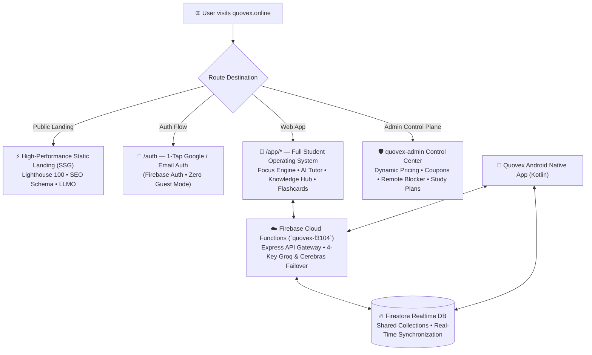

# Quovex — Marketing Site & Web Platform: Complete Master Specification

**Document Version:** 3.0 (Definitive Master Blueprint)  
**Domain:** `quovex.online`  
**Deployment Target:** Vercel (Edge CDN) / Firebase Hosting  
**Product Organization:** Refind Global Studio  
**Founders:** Rohit & Kartikey (11th Grade Students, Noida, Uttar Pradesh, India 🇮🇳)  
**Support Email:** supportquovex@gmail.com  
**Business Email:** Refindglobalstudio@gmail.com  
**Firebase Production Project:** `quovex-f3104` (Blaze Plan — Active ✅)  
**Brand Identity Invariant:** "Thought and crafted in India 🇮🇳 by Rohit & Kartikey"  

---

## 📑 Table of Contents

1. [Executive Summary & Product Vision](#1-executive-summary--product-vision)
2. [Brand Identity & Origin](#2-brand-identity--origin)
3. [Unified Multi-Platform Architecture](#3-unified-multi-platform-architecture)
4. [Unified Authentication & Cross-Platform Sync](#4-unified-authentication--cross-platform-sync)
5. [Design System & UI/UX Tokens](#5-design-system--uiux-tokens)
6. [Asset Inventory & Visual Blueprint](#6-asset-inventory--visual-blueprint)
7. [SEO & AI Search Optimization (LLMO)](#7-seo--ai-search-optimization-llmo)
8. [Dynamic Pricing, Free Trial & Subscription Tiers](#8-dynamic-pricing-free-trial--subscription-tiers)
9. [Admin Control Center: Dynamic Pricing, Flash Offers & Coupons](#9-admin-control-center-dynamic-pricing-flash-offers--coupons)
10. [Global Payment Architecture & PPP Engine](#10-global-payment-architecture--ppp-engine)
11. [Account Setup Guides: Razorpay & Lemon Squeezy](#11-account-setup-guides-razorpay--lemon-squeezy)
12. [Zero-Trust Security & API Key Isolation](#12-zero-trust-security--api-key-isolation)
13. [Smart Android App Download Banner](#13-smart-android-app-download-banner)
14. [Landing Page Specification (9 Comprehensive Sections)](#14-landing-page-specification-9-comprehensive-sections)
15. [Web Application Platform Specification (All Pages & Routes)](#15-web-application-platform-specification-all-pages--routes)
16. [Complete Project Repository Structure](#16-complete-project-repository-structure)
17. [Verification, Testing & Launch Checklist](#17-verification-testing--launch-checklist)

---

## 1. Executive Summary & Product Vision

**Quovex** is an AI-powered Student Operating System and learning transformation ecosystem engineered for ambitious students globally (JEE, NEET, CBSE Boards, UPSC, SAT, MCAT, A-Levels, and university academics). 

Instead of forcing students to juggle 5+ disconnected applications (Forest for timing, Anki for spaced repetition, Notion for notes, ChatGPT for explanations, and Freedom for app blocking), Quovex unifies everything into one seamless, high-performance platform across Android native and the modern Web (`quovex.online`).

### Core Value Pillars
- **Zero Friction Entry:** 100% unified Firebase authentication with zero guest mode.
- **AI-Powered Learning Assets:** Raw PDFs, notes, and topics transform into structured summaries, SM-2 flashcard decks, formula sheets, and diagnostic quizzes.
- **Extreme Focus & Flow:** Multi-interval timer with binaural beats, ambient soundscapes, and gamified streak protection.
- **Community Accountability:** Real-time exam-filtered virtual study rooms and live XP leaderboards.
- **Fair Global Accessibility:** Dynamic Purchasing Power Parity (PPP) pricing, admin-managed promotional coupons, and an accessible 7-day free trial on annual tiers.

---

## 2. Brand Identity & Origin

```
┌────────────────────────────────────────────────────────────────────────┐
│  ⚡ QUOVEX — The Last Study App You'll Ever Need                       │
│  A Product of Refind Global Studio                                     │
│  Thought and crafted in India 🇮🇳 by Rohit & Kartikey                  │
│  11th Grade Innovators • Noida, Uttar Pradesh, India                   │
│                                                                        │
│  Support: supportquovex@gmail.com                                      │
│  Business: Refindglobalstudio@gmail.com                                │
│  © 2026 Refind Global Studio. All rights reserved.                     │
└────────────────────────────────────────────────────────────────────────┘
```

### Brand Principles
1. **Student-Centric Authenticity:** Built by students who actively experience high-stakes exam pressure. Every feature solves a visceral pain point.
2. **Quovex AI Brand Redaction:** Under no circumstances are underlying LLM providers (Groq, Cerebras, OpenAI, Qwen, Meta) or internal model identifiers exposed to students. All intelligence is branded exclusively as **Quovex AI**.
3. **Proud Indian Heritage with Global Ambition:** Highlight Indian engineering pride ("Thought and crafted in India 🇮🇳") while providing localized language and currency experiences for international learners.

---

## 3. Unified Multi-Platform Architecture

The `quovex.online` deployment utilizes Next.js 15 (App Router) to deliver both a blazingly fast, SSG-rendered marketing landing page (targeting 100/100 Google Lighthouse scores) and a dynamic, CSR-rendered client web application that mirrors the Android app's capabilities.



---

## 4. Unified Authentication & Cross-Platform Sync

### Strict Authentication Policy
* **Zero Guest Mode:** In accordance with core security rules, no unauthenticated guest states exist. All users must authenticate via Firebase Auth.
* **Single Unified Identity:** One Firebase UID per student spans across Android native, mobile web, and desktop web.
* **Authentication Providers:**
  1. **Google 1-Tap Sign-In** (`GoogleAuthProvider` via popup or credential manager).
  
* **Session Persistence:** Browser `IndexedDB` local persistence on web; encrypted Keystore shared preferences on Android.

### Real-Time Cross-Platform Data Sync Matrix

| Data Domain | Firestore Path | Android Native | Web Platform (`quovex.online`) | Admin Control Center |
|---|---|---|---|---|
| **User Profile & Tier** | `users/{uid}` | Read / Write | Read / Write | Full RBAC Audit |
| **Study Sessions** | `users/{uid}/sessions/{id}` | Real-Time Sync | Real-Time Sync | Aggregated Analytics |
| **Streak & Milestones** | `users/{uid}/streak` | Real-Time Sync | Real-Time Sync | Read Only |
| **Learning Materials** | `notes/{id}` (indexed by userId) | Real-Time Sync | Real-Time Sync | Moderation Triage |
| **Flashcard Decks** | `users/{uid}/flashcard_decks/{id}` | Real-Time Sync | Real-Time Sync | Read Only |
| **AI Study Plans** | `study_plans/{id}` | Real-Time Sync | Real-Time Sync | Study Plan Inspector |
| **AI Quota & Usage** | `users/{uid}/ai_quota` | Shared 10/day Counter | Shared 10/day Counter | Rate Limit Override |
| **Live Study Rooms** | `study_rooms/{roomId}/participants` | Real-Time Listener | Real-Time Listener | Room Moderation |
| **Global Leaderboards** | `leaderboard/{id}` | Read / Write | Read / Write | Anti-Cheat Purge |
| **Remote Pricing Config** | `config/pricing` | Read (at launch) | Read (at runtime) | Write (Admin SDK) |
| **Coupons & Offers** | `config/coupons/{code}` | Read / Validate | Read / Validate | Create / Deactivate |

---

## 5. Design System & UI/UX Tokens

The Quovex visual language is dark-first, modern, and immersive. It incorporates vibrant emerald accents, glassmorphic elevation, and crisp typographic hierarchy.

### CSS Custom Properties (Dark Mode — Default)

```css
:root {
  /* --- Primary Brand Emerald Palette --- */
  --primary:            #00C896;  /* Main Brand Emerald: CTAs, active states, timer ring */
  --primary-variant:    #00A87A;  /* Pressed / Hover Emerald */
  --primary-container:  #003D2E;  /* Emerald surface container / Chips / Badges */
  --on-primary:         #000000;  /* Crisp contrast text on Emerald */
  --secondary:          #34D399;  /* Secondary accent green */
  --accent-glow:        #00FF9D;  /* Neon pulse glow / Focus effects */

  /* --- Dark Backgrounds & Elevated Surfaces --- */
  --background:         #0A0F0D;  /* Pure Dark Charcoal Root Background */
  --surface:            #111917;  /* Standard Card / Bottom Sheet Surface */
  --surface-variant:    #1C2B24;  /* Input fields / Elevated sub-cards */
  --surface-elevated:   #15201C;  /* Floating navigation panels / Popovers */

  /* --- Borders & Outlines --- */
  --outline:            #2D4438;  /* Crisp card borders */
  --outline-variant:    #1F2E28;  /* Subtle dividers / separators */

  /* --- Typography Contrast Tokens --- */
  --on-background:      #E8F5F0;  /* Primary high-contrast text */
  --on-surface:         #C4DDD5;  /* Secondary body text */
  --on-surface-variant: #8AAFA3;  /* Muted placeholder / caption text */

  /* --- Gamification & Semantic Alerts --- */
  --error:              #FF5252;  /* Destructive actions / Errors */
  --warning:            #FFB800;  /* Streak rescue alert / Cautions */
  --success:            #00C896;  /* Milestone / Success confirmation */
  --xp-gold:            #FFD700;  /* Scholar XP / Gold Badges / Founder tier */
  --streak-fire:        #FF6B35;  /* Vibrant Fire Streak flame */

  /* --- Glassmorphism & Shadows --- */
  --glass-bg:           rgba(17, 25, 23, 0.75);
  --glass-border:       rgba(0, 200, 150, 0.18);
  --shadow-card:        0 4px 24px rgba(0, 200, 150, 0.06);
  --shadow-hover:       0 8px 32px rgba(0, 200, 150, 0.18);
  --shadow-floating:    0 16px 48px rgba(0, 0, 0, 0.5);
  --glow-emerald:       0 0 20px rgba(0, 200, 150, 0.35);

  /* --- Typography Families --- */
  --font-sans:          'Inter', -apple-system, BlinkMacSystemFont, 'Segoe UI', Roboto, sans-serif;
  --font-mono:          'JetBrains Mono', 'Fira Code', monospace;

  /* --- Spacing System (8px Grid) --- */
  --space-xs:  4px;
  --space-sm:  8px;
  --space-md:  16px;
  --space-lg:  24px;
  --space-xl:  32px;
  --space-2xl: 48px;
  --space-3xl: 64px;

  /* --- Border Radius Scale --- */
  --radius-sm:   8px;     /* Chips, tags, small inputs */
  --radius-md:   16px;    /* Cards, dialogs, media previews */
  --radius-lg:   24px;    /* Large panels, floating modals */
  --radius-xl:   32px;    /* Floating action buttons, hero badges */
  --radius-pill: 9999px;  /* Pill buttons and status indicators */
}
```

---

## 6. Asset Inventory & Visual Blueprint

All production assets are strictly cataloged and stored in `/public/assets/`:

```
public/assets/
├── logo.svg                   # Quovex Emerald vector wordmark
├── ic_mark.svg                # Stylized 'Q' lightning-timer icon
├── logo_anim.json             # Lottie brand reveal animation
├── og_banner.jpg              # 1200x630 High-res social share banner
├── hero_mockup.webp           # 3D angled Android dashboard preview
├── feature_timer.webp         # Focus timer with soundscape waveform
├── feature_ai.webp            # AI tutor step-by-step chat interface
├── feature_flashcards.webp    # SM-2 active recall flip card
├── feature_community.webp     # Live exam study room with active peers
├── avatars/
│   ├── avatar_1.webp ... avatar_12.webp # Preset student scholar avatars
└── badges/
    ├── badge_novice.webp ... badge_legend.webp # Tier achievement emblems
```

---

## 7. SEO & AI Search Optimization (LLMO)

### 7.1 JSON-LD Structured Schema Markup (`app/layout.tsx`)
```json
{
  "@context": "https://schema.org",
  "@type": "SoftwareApplication",
  "name": "Quovex",
  "url": "https://quovex.online",
  "operatingSystem": "ANDROID, WEB, PWA",
  "applicationCategory": "EducationalApplication",
  "description": "AI-Powered Student Operating System replacing Forest, Anki, Notion, and ChatGPT with unified focus timers, SM-2 flashcards, AI doubt solving, and NCERT library.",
  "author": {
    "@type": "Organization",
    "name": "Refind Global Studio",
    "email": "Refindglobalstudio@gmail.com",
    "foundingDate": "2026",
    "founders": [
      { "@type": "Person", "name": "Rohit" },
      { "@type": "Person", "name": "Kartikey" }
    ],
    "address": {
      "@type": "PostalAddress",
      "addressLocality": "Noida",
      "addressRegion": "Uttar Pradesh",
      "addressCountry": "IN"
    }
  },
  "offers": [
    { "@type": "Offer", "name": "Scholar Free", "price": "0", "priceCurrency": "INR" },
    { "@type": "Offer", "name": "Pro Monthly", "price": "199", "priceCurrency": "INR" },
    { "@type": "Offer", "name": "Pro Annual (7-Day Free Trial)", "price": "999", "priceCurrency": "INR" },
    { "@type": "Offer", "name": "Founder Lifetime", "price": "2499", "priceCurrency": "INR" }
  ],
  "aggregateRating": {
    "@type": "AggregateRating",
    "ratingValue": "4.8",
    "ratingCount": "1420",
    "bestRating": "5"
  }
}
```

### 7.2 AI Crawler Ingestion (`public/llms.txt`)
Hosted at `https://quovex.online/llms.txt` for indexing by Claude, Perplexity, ChatGPT Search, and Gemini. Contains full contextual breakdowns of features, founder background, pricing, and platform links.

### 7.3 Crawl Directives (`public/robots.txt` & `public/sitemap.xml`)
- All marketing and documentation routes are fully indexable (`Allow: /`).
- Private authenticated dashboard subpaths (`/app/*`, `/api/*`) are secured against public web indexing.

---

## 8. Dynamic Pricing, Free Trial & Subscription Tiers

### Feature Matrix Across Tiers (Matched with Android `BillingModels.kt`)

| Core Capabilities | Scholar Free | Pro Monthly | Pro Annual (⭐ Best Value) | Founder Lifetime 🚀 |
|---|---|---|---|---|
| **Base Price (India 🇮🇳)** | **₹0 Forever** | **₹199 / month** | **₹999 / year** *(₹83/mo)* | **₹2,499 One-Time** |
| **Base Price (Global 🇺🇸)** | **$0 Forever** | **$4.99 / month** | **$34.99 / year** *(~$2.91/mo)* | **$89.99 One-Time** |
| **7-Day Free Trial** | ❌ None | ❌ None | **✅ 7 Days Zero Upfront** | ❌ None |
| **Daily AI Doubts & Tutor** | 10 queries/day | ⚡ Unlimited | ⚡ Unlimited (Priority) | ⚡ Unlimited Permanent |
| **SM-2 Smart Flashcards** | Unlimited Decks | Unlimited Decks | Unlimited Decks | Unlimited Decks |
| **Focus Timer & Soundscapes** | 3 Basic Sounds | All 9 Binaural Sounds | All 9 Binaural Sounds | All 9 Binaural Sounds |
| **NCERT Catalog & AI Summaries**| Standard Access | Unlimited Extraction | Unlimited Extraction | Unlimited Extraction |
| **AI Study Planner** | Basic Plan | Cerebras AI Roadmap | Advanced Dynamic Roadmap | Lifetime AI Evolution |
| **Live Study Rooms** | Public Rooms Only | Public + Private Rooms | Public + Private Rooms | VIP Founder Access |
| **Streak Rescue Tokens** | 1 Token / Week | Unlimited Protection | Unlimited Protection | Unlimited Protection |
| **Ad-Free Clean UI** | Banner Supported | 100% Clean Ad-Free | 100% Clean Ad-Free | 100% Clean Ad-Free |

### 7-Day Free Trial Architecture
* **Eligibility:** Exclusive to the **Pro Annual** subscription tier.
* **Zero Initial Friction:** User authenticates payment method with gateway; initial charge is $0.00 / ₹0.
* **Auto-Billing:** Auto-renews on Day 8 unless canceled in account settings.
* **One Trial Policy:** Locked per unique Firebase UID via `users/{uid}.trialUsed = true`.

---

## 9. Admin Control Center: Dynamic Pricing, Flash Offers & Coupons

To ensure maximum marketing agility, all pricing rules, flash sales, and promo codes are decoupled from code deployments. They are governed dynamically via Firestore document listeners.

### 9.1 Firestore Schema

#### `config/pricing`
```json
{
  "monthly": {
    "priceInr": 199,
    "priceUsd": 4.99,
    "badge": "LAUNCH OFFER • ₹99 1st MONTH",
    "isActive": true
  },
  "annual": {
    "priceInr": 999,
    "priceUsd": 34.99,
    "trialDays": 7,
    "badge": "⭐ 7-DAY FREE TRIAL • SAVE 60%",
    "savingsPercentage": 60,
    "isActive": true
  },
  "lifetime": {
    "priceInr": 2499,
    "priceUsd": 89.99,
    "badge": "🚀 FOUNDER PASS • PERMANENT ACCESS",
    "isActive": true
  }
}
```

#### `config/coupons/{CODE}` (e.g., `config/coupons/ROHIT50`)
```json
{
  "code": "ROHIT50",
  "discountPercent": 50,
  "applicableTiers": ["pro_monthly", "pro_annual"],
  "maxRedemptions": 1000,
  "redemptionsCount": 248,
  "validUntil": "2026-12-31T23:59:59Z",
  "isActive": true,
  "createdBy": "admin_rohit",
  "description": "Founder special launch promo"
}
```

#### `config/flash_offer`
```json
{
  "isActive": true,
  "bannerTitle": "⚡ EXAM SEASON CRASH OFFER: 50% OFF ANNUAL PRO",
  "couponCode": "EXAM50",
  "countdownEnd": "2026-08-31T23:59:59Z",
  "targetCountries": ["IN", "US", "GLOBAL"]
}
```

---

## 10. Global Payment Architecture & PPP Engine

Quovex deploys a dual-gateway architecture that intelligently routes students based on geographical IP detection:

```mermaid
graph TD
    Checkout["🛒 Student Clicks 'Upgrade to Pro'"] --> GeoDetect["📍 Edge Middleware detects Country Code"]
    
    GeoDetect -->|Country = 'IN' (India)| RZP["🇮🇳 Razorpay Gateway<br/>UPI • PhonePe • GPay • NetBanking • RuPay"]
    GeoDetect -->|Country != 'IN' (Global)| LS["🌍 Lemon Squeezy Gateway<br/>Cards • PayPal • Apple Pay • Regional Wallets"]
    
    RZP -->|Payment Success Webhook| WebhookAPI["🛡️ Firebase Cloud Function<br/>`/payment/webhook` (Signature Verified)"]
    LS -->|Payment Success Webhook| WebhookAPI
    
    WebhookAPI --> UpdateUser["🔥 Firestore Update<br/>`users/{uid}.subscriptionTier = 'pro_annual'`<br/>`users/{uid}.subscriptionStatus = 'active'`"]
    UpdateUser --> CrossSync["✨ Realtime Entitlement Unlocked on Android & Web"]
```

### 20-Country Purchasing Power Parity (PPP) Matrix

| Country | Code | Gateway | Currency | Pro Monthly | Pro Annual (7-Day Trial) | Lifetime Founder |
|---|---|---|---|---|---|---|
| 🇮🇳 **India** | `IN` | **Razorpay** | **INR (₹)** | **₹199** | **₹999** | **₹2,499** |
| 🇺🇸 **United States** | `US` | **Lemon Squeezy** | **USD ($)** | **$4.99** | **$34.99** | **$89.99** |
| 🇬🇧 **United Kingdom** | `GB` | **Lemon Squeezy** | **GBP (£)** | **£3.99** | **£27.99** | **£69.99** |
| 🇪🇺 **Germany / France**| `EU` | **Lemon Squeezy** | **EUR (€)** | **€4.49** | **€29.99** | **€79.99** |
| 🇧🇷 **Brazil** | `BR` | **Lemon Squeezy** | **BRL (R$)** | **R$ 14.99** | **R$ 99.99** | **R$ 249.99** |
| 🇮🇩 **Indonesia** | `ID` | **Lemon Squeezy** | **IDR (Rp)** | **Rp 29,000** | **Rp 199,000** | **Rp 499,000** |
| 🇵🇰 **Pakistan** | `PK` | **Lemon Squeezy** | **PKR (₨)** | **₨ 499** | **₨ 2,999** | **₨ 6,999** |
| 🇧🇩 **Bangladesh** | `BD` | **Lemon Squeezy** | **BDT (৳)** | **৳ 199** | **৳ 1,299** | **৳ 2,999** |
| 🇳🇬 **Nigeria** | `NG` | **Lemon Squeezy** | **NGN (₦)** | **₦ 2,000** | **₦ 13,000** | **₦ 29,000** |
| 🇵🇭 **Philippines** | `PH` | **Lemon Squeezy** | **PHP (₱)** | **₱ 149** | **₱ 999** | **₱ 2,499** |
| 🇲🇾 **Malaysia** | `MY` | **Lemon Squeezy** | **MYR (RM)**| **RM 9.99** | **RM 69.99** | **RM 169.99** |
| 🇦🇺 **Australia** | `AU` | **Lemon Squeezy** | **AUD (A$)**| **A$ 7.49** | **A$ 52.99** | **A$ 129.99** |
| 🇨🇦 **Canada** | `CA` | **Lemon Squeezy** | **CAD (C$)**| **C$ 6.49** | **C$ 45.99** | **C$ 119.99** |
| 🇦🇪 **UAE** | `AE` | **Lemon Squeezy** | **AED (د.إ)**| **AED 17.99**| **AED 124.99**| **AED 299.99** |
| 🇸🇦 **Saudi Arabia** | `SA` | **Lemon Squeezy** | **SAR (﷼)** | **SAR 17.99**| **SAR 124.99**| **SAR 299.99** |
| 🌍 **All Others** | `*` | **Lemon Squeezy** | **USD ($)** | **$4.99** | **$34.99** | **$89.99** |

---

## 11. Account Setup Guides: Razorpay & Lemon Squeezy

Because the founders do not yet possess active merchant accounts, follow this exact step-by-step roadmap:

### 11.1 Razorpay Setup (India 🇮🇳)
1. **Registration:** Visit [razorpay.com](https://razorpay.com) and create an account using `Refindglobalstudio@gmail.com`.
2. **KYC Verification:** Provide basic business identity (Individual / Proprietorship registered in Noida, UP).
3. **API Keys:** Navigate to **Settings → API Keys → Generate Key**.
4. **Environment Secrets:**
   ```bash
   firebase functions:secrets:set RAZORPAY_KEY_ID
   firebase functions:secrets:set RAZORPAY_KEY_SECRET
   ```
5. **Webhook Configuration:** Configure Webhook URL in Razorpay Dashboard:
   `https://us-central1-quovex-f3104.cloudfunctions.net/api/payment/razorpay-webhook`
   Subscribed events: `order.paid`, `subscription.charged`, `subscription.cancelled`.

### 11.2 Lemon Squeezy Setup (Global 🌍)
1. **Registration:** Visit [lemonsqueezy.com](https://lemonsqueezy.com) and sign up with `Refindglobalstudio@gmail.com`.
2. **Merchant of Record Setup:** Set store name as **Quovex** (under Refind Global Studio). Lemon Squeezy legally manages international VAT/sales tax.
3. **Create Products:** Create 3 products matching the subscription tiers (`Pro Monthly`, `Pro Annual`, `Founder Lifetime`).
4. **Configure PPP Variants:** Add regional currency pricing matching Section 10.
5. **Environment Secrets:**
   ```bash
   firebase functions:secrets:set LEMONSQUEEZY_API_KEY
   firebase functions:secrets:set LEMONSQUEEZY_WEBHOOK_SECRET
   ```
6. **Webhook URL:**
   `https://us-central1-quovex-f3104.cloudfunctions.net/api/payment/lemonsqueezy-webhook`

---

## 12. Zero-Trust Security & API Key Isolation

```
┌───────────────────────────────────────────────────────────────────────┐
│                       ZERO-EXPOSURE SHIELD                            │
│                                                                       │
│  [Browser / Client App]                                               │
│       │ (Sends ONLY Firebase ID Token in Authorization Header)        │
│       ▼                                                               │
│  [Next.js Server / Firebase Cloud Functions Backend]                  │
│       │ (Authenticates Token via Firebase Admin SDK)                  │
│       ▼                                                               │
│  [Encrypted Secret Vault]                                             │
│       ├── GROQ_API_KEY_1..4        (Never leaves server)              │
│       ├── CEREBRAS_API_KEY_1..4    (Never leaves server)              │
│       ├── RAZORPAY_KEY_SECRET      (Never leaves server)              │
│       └── LEMONSQUEEZY_API_KEY     (Never leaves server)              │
└───────────────────────────────────────────────────────────────────────┘
```

1. **Client Isolation:** No LLM keys, payment secret keys, or raw backend credentials exist in client bundles or public repositories.
2. **Server-Side Coupon Reductions:** Discount math is calculated exclusively on the backend to prevent malicious client price alterations.
3. **Strict Firestore Rules:** Document writes to `config/*`, `audit_logs/*`, and other administrative trees are blocked at the database engine level for client auth tokens.

---

## 13. Smart Android App Download Banner

A smart floating banner on mobile browsers encourages installation of the native Android application while preserving user convenience.

### Behavior Specification
* **Target Audience:** Rendered exclusively on mobile browser viewports (Android Chrome, iOS Safari).
* **Location & Animation:** Fixed bottom docked card with spring entrance animation (`translateY(100%) → translateY(0)`).
* **Dismissal Cache:** Tapping `[✕ Close]` sets `localStorage.setItem('app_banner_dismissed', Date.now())` for 7 days.
* **Platform Logic:**
  * **Android Devices:** Direct CTA `[⬇ Download Android App]` leading to Google Play Store (or APK download fallback).
  * **iOS Devices:** Informational badge `"iOS App in Beta • Tap Share → Add to Home Screen for PWA"`.

---

## 14. Landing Page Specification (9 Comprehensive Sections)

### Section 1: Hero Command Center
* **Headline:** *"The Last Study App You'll Ever Need."*
* **Sub-Headline:** *"Your AI-powered Student Operating System. Transform messy notes into smart flashcards, destroy distractions with focus timers, and study alongside thousands of peers."*
* **Primary Action:** `[✨ Start Free with Google]` (1-Tap signup).
* **Secondary Action:** `[⬇ Download Android App]`.
* **Visual Anchor:** 3D floating Android device mockup showcasing the emerald focus dashboard with subtle particle animation.

### Section 2: The Student Dilemma (Animated Counters)
* Stat 1: **90%** of students lose focus to doom-scrolling within 15 minutes.
* Stat 2: **75%** rely on passive re-reading with near-zero exam recall.
* Stat 3: **65%** juggle 4+ disconnected apps (Notion, Anki, Forest, ChatGPT).
* Stat 4: **60%** experience severe decision paralysis on where to begin.

### Section 3: The 5-in-1 Transformation System
* Interactive before/after comparative matrix showing how Quovex consolidates Forest + Anki + Notion + ChatGPT + Freedom into one unified platform.

### Section 4: The 6 Core Engineering Pillars (Bento Grid)
1. **Focus Engine & Waveforms:** Interval timers, binaural beats, and distraction logging.
2. **Quovex AI Tutor:** 24/7 step-by-step doubt resolution with formula notation.
3. **SM-2 Spaced Repetition:** Automated flashcards generated from study notes.
4. **Knowledge Hub:** NCERT library Class 6–12 with instant AI chapter extraction.
5. **Streak Protection:** Daily gamified consistency with Rescue Tokens.
6. **Live Study Rooms:** Exam-filtered peer presence with real-time timers.

### Section 5: Real-Time Live Study Leaderboard
* Horizontal scrolling ticker displaying active scholars, weekly XP badges, and exam tags fetched live from Firestore.

### Section 6: Authentic Student Testimonials
* 6 detailed student success stories spanning JEE Advanced, NEET UG, CBSE Class 12, UPSC Foundation, SAT, and University Engineering.

### Section 7: Dynamic Region-Aware Pricing
* Auto-renders local currency based on IP detection. Highlights the **7-Day Free Trial** on the Pro Annual plan. Includes coupon entry input.

### Section 8: Final Call to Action
* High-impact closing banner: *"Step into the top 1% of disciplined students."*

### Section 9: Comprehensive Footer & Heritage Attribution
* **Attribution Line:** *"Thought and crafted in India 🇮🇳 by Rohit & Kartikey (Noida, UP)"*
* **Corporate Details:** Refind Global Studio • Founded 2026.
* **Direct Links:** Privacy Policy, Terms of Service, Support Email (`supportquovex@gmail.com`), Business Email (`Refindglobalstudio@gmail.com`).

---

## 15. Web Application Platform Specification (All Pages & Routes)

| Web App Route | Page Title | Core Capabilities |
|---|---|---|
| `/auth` | Student Access Gateway | 1-Tap Google Sign-In & Email Authentication (Zero Guest Mode). |
| `/app/dashboard` | Student Command Center | Daily AI briefing, active streaks, quick launch tools, weekly study heatmaps. |
| `/app/timer` | Focus Engine | Pomodoro/Deep work intervals, Web Audio binaural beats, distraction logs. |
| `/app/ai` | Quovex AI Tutor | Streaming conceptual chat, step-by-step derivations, LaTeX rendering. |
| `/app/ai/doubt` | Visual Doubt Solver | Multimodal image upload solving math, physics, and chemistry equations. |
| `/app/knowledge` | Knowledge Hub | Searchable study notes, NCERT repository, and Quovex Originals library. |
| `/app/knowledge/ncert` | NCERT Book Explorer | Class 6-12 PDF directory with integrated chapter summarizer. |
| `/app/knowledge/notes` | Learning Materials | AI-transformed study guides, key formulas, and conceptual overviews. |
| `/app/flashcards` | Flashcard Decks | Spaced repetition deck directory with mastery percentage indicators. |
| `/app/flashcards/[id]` | Active Recall Player | Interactive SM-2 flip cards (`Forgot`, `Hard`, `Good`, `Easy`). |
| `/app/planner` | AI Study Planner | Dynamic weekly roadmap calibrated to exam dates and subject mastery. |
| `/app/streaks` | Streak & Milestones | GitHub-style 90-day study heatmap, Rescue Token vault, Scholar badges. |
| `/app/quiz` | Diagnostic Quiz | Daily 5-question adaptive assessment with remedial flashcard generation. |
| `/app/community` | Study Rooms & Ranks | Live exam rooms (JEE, NEET, CBSE, SAT) with emoji reactions and XP ranks. |
| `/app/profile` | Scholar Profile & Settings | Avatar customization, referral code tracker, coupon redemption, Pro upgrade. |
| `/privacy` | Privacy Policy | Full Google Play Store compliant data privacy documentation. |
| `/terms` | Terms of Service | User agreement, refund rules, and acceptable use terms. |

---

## 16. Complete Project Repository Structure

```
d:\Quovex APP\quovex-web\
├── package.json
├── next.config.ts                     # PWA, image optimizations, headers
├── tailwind.config.ts                 # Full Quovex color token configuration
├── tsconfig.json
├── middleware.ts                      # Edge Geo-IP detection & auth session validation
├── .env.local.example                 # Public Firebase credentials blueprint
│
├── public/
│   ├── llms.txt                       # AI search engine context document
│   ├── robots.txt                     # Crawler directives
│   ├── sitemap.xml                    # Canonical search engine index
│   ├── manifest.json                  # PWA offline & standalone manifest
│   └── assets/                        # WebP mockups, icons, avatars, badges
│
├── app/
│   ├── layout.tsx                     # Global layout (Inter font, JSON-LD schema, OG tags)
│   ├── page.tsx                       # High-converting SSG Landing Page
│   ├── auth/page.tsx                  # Unified Authentication Screen
│   ├── privacy/page.tsx               # Play Store Compliant Privacy Policy
│   ├── terms/page.tsx                 # Terms of Service
│   ├── app/
│   │   ├── layout.tsx                 # Protected shell (Sidebar, MobileNav, Banner)
│   │   ├── dashboard/page.tsx
│   │   ├── timer/page.tsx
│   │   ├── ai/page.tsx
│   │   ├── ai/doubt/page.tsx
│   │   ├── knowledge/page.tsx
│   │   ├── knowledge/ncert/page.tsx
│   │   ├── knowledge/notes/page.tsx
│   │   ├── flashcards/page.tsx
│   │   ├── flashcards/[deckId]/page.tsx
│   │   ├── planner/page.tsx
│   │   ├── streaks/page.tsx
│   │   ├── quiz/page.tsx
│   │   ├── community/page.tsx
│   │   └── profile/page.tsx
│   └── api/
│       ├── payment/checkout/route.ts  # Server-side checkout generator
│       ├── payment/validate-coupon/route.ts # Server-side discount validator
│       └── auth/session/route.ts      # HttpOnly session cookie manager
│
├── components/
│   ├── landing/                       # 9 Landing Section Components
│   ├── app/                           # Web Platform Feature UI Components
│   └── ui/                            # Shared Primitives (Buttons, Cards, Badges, Modals)
│
├── lib/
│   ├── firebase/client.ts             # Firebase client SDK initialization
│   ├── firebase/auth.ts               # Authentication helper functions
│   ├── firebase/firestore.ts          # Typed Firestore access methods
│   ├── api.ts                         # Backend API client with Bearer token injection
│   ├── pricing.ts                     # PPP lookup engine & country pricing resolver
│   ├── sm2.ts                         # Spaced repetition scheduling algorithm
│   └── hooks/                         # useAuth, useTimer, useStreak, useFlashcards
│
└── styles/
    └── globals.css                    # Quovex CSS custom properties & utility animations
```

---

## 17. Verification, Testing & Launch Checklist

- [ ] **Lighthouse Verification:** Run audit on `quovex.online/` ensuring 100/100 across Performance, SEO, Accessibility, and Best Practices.
- [ ] **Authentication Verification:** Validate 1-tap Google Sign-in and Email auth flow; verify automatic redirect of unauthenticated users to `/auth`.
- [ ] **Cross-Platform Sync Verification:** Create a study session and flashcard deck on Web; verify instant appearance on Android native app.
- [ ] **AI Proxy Verification:** Send query to `/app/ai`; verify streaming response with zero exposure of Groq/Cerebras provider names or keys.
- [ ] **Dynamic Pricing & Coupon Verification:** Test coupon redemption via server route; ensure instant price discount reflected in checkout.
- [ ] **7-Day Trial Verification:** Confirm Annual plan records `subscriptionStatus: 'trialing'` with 7-day future billing timestamp.
- [ ] **Smart Banner Verification:** Emulate mobile user agent; verify banner appears after 5s and dismisses cleanly for 7 days.
- [ ] **LLMO Verification:** Fetch `quovex.online/llms.txt` and validate comprehensive AI search crawler readability.
