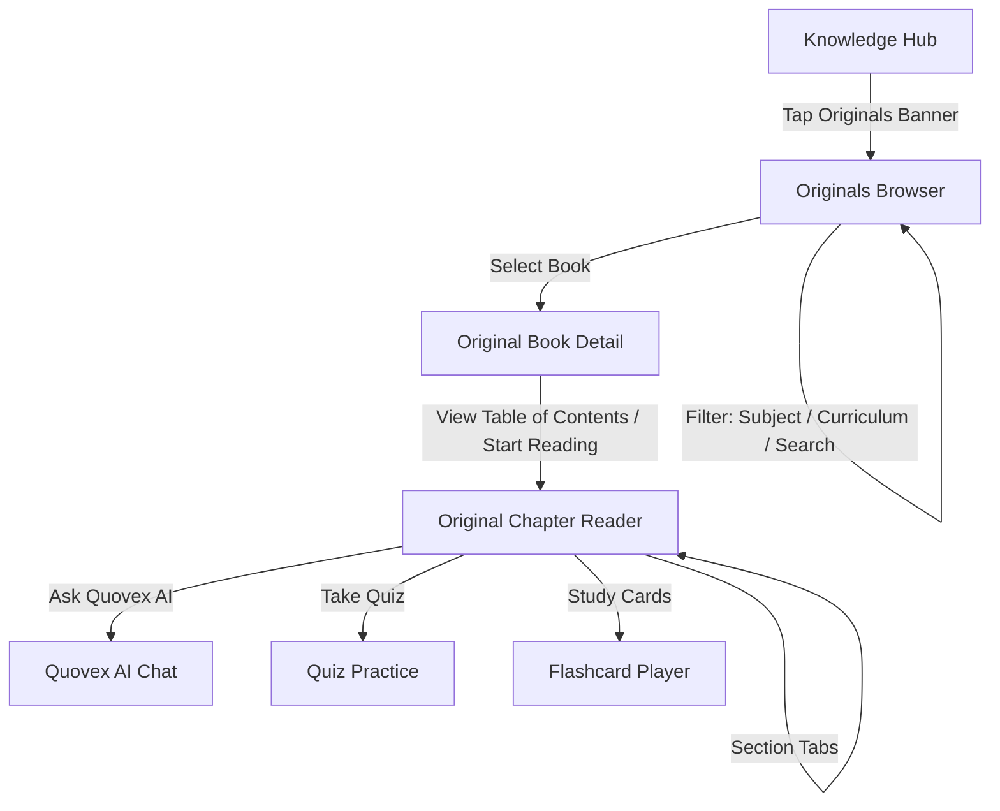

# Quovex Originals Student Experience — Specification (Phase 10)

## 1. Executive Summary
**Quovex Originals** is the student-facing catalog and reading experience for AI-crafted, curriculum-aligned, high-yield educational books. Originating from the Phase 8 Content Studio pipeline and verified through Phase 9 human editorial sign-offs, Quovex Originals represents the gold-standard proprietary learning material within Quovex.

---

## 2. Core Architecture & Invariants

### 2.1 Content Hierarchy
1. **Catalog / Book** (`QuovexOriginalBook`):
   - Metadata: Title, Subtitle, Topic, Subject, Curriculum, Class/Grade, Exam, Target Reading Time, Difficulty, Learning Objectives.
   - Security Invariant: Public read queries only return books where `approvalStatus == 'PUBLISHED'`.
2. **Chapter** (`OriginalChapter`):
   - Chapter Number, Title, Summary, Section List, Integrated Flashcards, Integrated Quiz Questions.
3. **Section** (`OriginalSection`):
   - Conceptual Explanation (with Unicode / LaTeX formatting via `QuovexMathText`).
   - Visual Analogy.
   - Step-by-Step Worked Problems (with step-by-step formulas, solutions, and key takeaways).
   - Real-World Engineering / Scientific Case Studies.
   - Common Student Traps & Misconceptions.
   - Quick Revision Key Takeaways.

### 2.2 Student Privacy & Zero-Mock Invariant
- **Zero Mock Data:** Every rendered book, chapter, and section is retrieved from Firestore `quovex_originals`. If no books are published in a selected filter category, a clean empty state is displayed.
- **AI Identity:** Student AI interactions are branded strictly as **Quovex AI**. Internal model names (Groq, Cerebras) are completely masked from student UI.

---

## 3. UI / UX Design & Navigation

### 3.1 Screens
1. **`OriginalsBrowserScreen.kt`**:
   - Filter chips for Subject (Physics, Chemistry, Mathematics, Biology) and Curriculum (CBSE, JEE, NEET, AP, IB).
   - Search bar querying titles, subtitles, and concepts.
   - Glassmorphic card grid showing chapter count, estimated reading time, and emerald badge.
2. **`OriginalBookDetailScreen.kt`**:
   - Header with full syllabus alignment and difficulty badge.
   - Core Learning Objectives check-list.
   - Interactive Table of Contents with section and practice asset counts.
3. **`OriginalChapterReaderScreen.kt`**:
   - Section navigation bar.
   - Rich math formatting using `QuovexMathText`.
   - Visual analogy and real-world application callouts.
   - Common student trap warnings highlighted in cautionary red tones.
   - Direct integration with Flashcards & Quiz practice.

---

## 4. Technical Implementation

| Component | Path | Responsibility |
|---|---|---|
| Domain Models | `com.quovex.domain.model.originals.QuovexOriginalModels.kt` | Pure Kotlin data classes |
| Repository Interface | `com.quovex.domain.repository.QuovexOriginalsRepository.kt` | Contract for querying published books |
| Repository Implementation | `com.quovex.data.repository.QuovexOriginalsRepositoryImpl.kt` | Firestore integration querying `quovex_originals` where `approvalStatus == 'PUBLISHED'` |
| Dependency Injection | `com.quovex.di.RepositoryModule.kt` | Hilt binding for `QuovexOriginalsRepository` |
| ViewModel | `com.quovex.ui.originals.OriginalsViewModel.kt` | State management for browsing, filtering, and reading |
| UI Screens | `com.quovex.ui.originals.*` | Jetpack Compose screens |
| Navigation | `QuovexRoutes.kt` & `QuovexNavGraph.kt` | App-wide destination mapping |
| Testing | `com.quovex.ui.originals.OriginalsViewModelTest.kt` | Unit tests for ViewModel and repository flow |
