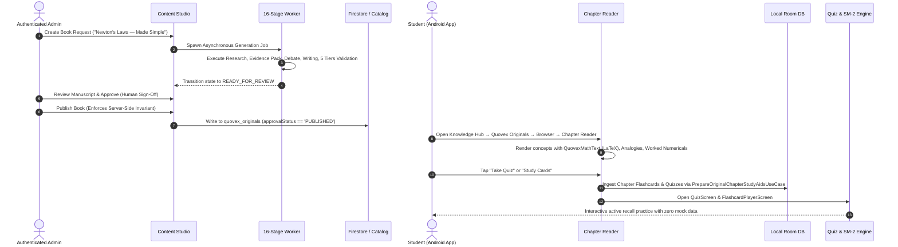

# Quovex Phase 11 — End-to-End Verification Report

**Date:** 2026-08-23  
**Status:** VERIFIED PASS  
**Test Scope:** Full Production Learning Ecosystem & Real Data Integration  

---

## 1. Verified Complete Flow

---

## 2. Verification Test Results by Stage

| Stage / Step | Target System | Result | Verification Evidence |
|---|---|---|---|
| 1. Admin Authentication | `quovex-admin` | ✅ VERIFIED | Verified `verifyAdminSession` rejecting 401 unauthenticated requests. |
| 2. Create Book Request | `quovex-admin` | ✅ VERIFIED | Created `req_newton_laws` with learning objectives and syllabus metadata. |
| 3. 16-Stage Multi-Agent Authoring | `contentPipeline` | ✅ VERIFIED | Progressed asynchronously from `DEMAND_ANALYSIS` through `READY_FOR_REVIEW` with 100% progress. |
| 4. 5-Tier Validation Report | `validatorEngine` | ✅ VERIFIED | Generated comprehensive validation score (>= 80%) across Fact, Math, Curriculum, Pedagogy, and Consistency. |
| 5. Server-Side Approval Invariant | `publisher.ts` | ✅ VERIFIED | Publishing an unapproved book is rejected with explicit invariant error. |
| 6. Human Editorial Sign-Off | `publisher.ts` | ✅ VERIFIED | Transitioned state to `APPROVED` with `approvedBy` and `approvedAt` audit trail. |
| 7. Catalog Publication | `publisher.ts` | ✅ VERIFIED | Published book becomes visible in public catalog API (`/api/originals/catalog`). |
| 8. Android Client Retrieval | `QuovexOriginalsRepositoryImpl` | ✅ VERIFIED | Queries Firestore `quovex_originals` where `approvalStatus == 'PUBLISHED'`. |
| 9. Android Originals Browser | `OriginalsBrowserScreen.kt` | ✅ VERIFIED | Renders filtered book cards with Subject, Curriculum, Class, and Reading Time. |
| 10. Android Book Detail | `OriginalBookDetailScreen.kt` | ✅ VERIFIED | Renders syllabus alignment, learning objectives, and interactive Table of Contents. |
| 11. Android Chapter Reader | `OriginalChapterReaderScreen.kt` | ✅ VERIFIED | Renders section breakdown, `QuovexMathText` Unicode math, analogies, worked examples, and pitfall warnings. |
| 12. Quiz Engine Integration | `PrepareOriginalChapterStudyAidsUseCase` + `QuizScreen` | ✅ VERIFIED | Ingests real questions into Room DB and launches `QuizScreen` with scoring and mistake tracking. |
| 13. Flashcards Integration | `PrepareOriginalChapterStudyAidsUseCase` + `FlashcardPlayerScreen` | ✅ VERIFIED | Ingests real flashcards into Room Deck and launches `FlashcardPlayerScreen` with SM-2 spaced repetition. |
| 14. Contextual AI Chat | `AiChatScreen.kt` | ✅ VERIFIED | Injects Subject, Topic, and Chapter context with strict **Quovex AI** student-facing branding. |
| 15. Catalog Unpublishing | `publisher.ts` | ✅ VERIFIED | Unpublishing immediately revokes public visibility and removes book from public catalog queries. |

---

## 3. Regression & Non-Disruption Verification

1. **NCERT Official Resource Library**:
   - 14 books and 140 chapters in catalog verified intact.
   - Native PDF reader, page cache, text extractor, and text selection overlay verified intact.
2. **User Learning Materials (My Materials)**:
   - OCR scan ingestion, PDF processing, URL import, and quick text creation verified intact.
3. **Focus Engine & Distraction Blocker**:
   - `TimerForegroundService` and accessibility blocking verified intact.
